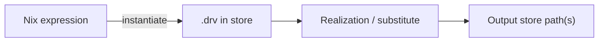

# Derivation

## Overview

A **derivation** is a build recipe: declared inputs (sources, dependencies, builder, environment) map to one or more [store paths](store-path.md). Evaluating Nix expressions—via `builtins.derivation` or wrappers such as `stdenv.mkDerivation`—produces derivation values; the Nix store holds a serialized `.drv` file for each one. **Realizing** a derivation runs its builder and materializes the output paths.

Derivations are **input-addressed** by default: the hash in an output path is determined by the derivation’s inputs, not by inspecting the built contents alone. That model differs from [fixed-output derivations](fixed-output-derivation.md) and [content-addressed](content-addressed-store.md) storage, where output identity follows a declared hash or content. See [hashing and inputs](../04-store-and-build/hashing-and-inputs.md).

## Details

**Expression → store derivation → realization.** A *derivation expression* in the Nix language describes a build. **Instantiation** registers it as a *store derivation*—a `.drv` file under `/nix/store`. **Realization** then ensures each output path is valid: build in a sandbox, substitute from a binary cache, or fetch from a remote builder. Evaluation alone does not run the builder.

**Inputs.** A derivation records everything needed to reproduce the build: source references, build-time dependencies (other derivations or store paths), the builder executable, arguments, and environment variables. Change any input and you get a different derivation—and different output paths. Only declared inputs participate in the hash; the sandbox is meant to hide undeclared host state.

**The `.drv` file.** When a derivation is registered with the store, Nix writes a `.drv` at a path derived from the derivation’s own hash. That file is the canonical build description, not the built artifact. Realizing it executes the builder and installs results under `/nix/store/...`.

**Output paths.** A derivation can declare multiple named outputs—commonly `out`, and in nixpkgs often `dev`, `doc`, `bin`, and others. Each output is its own store path, all recorded in the same `.drv`. Multiple outputs let runtime and build-time pieces be copied or garbage-collected separately.

**Input addressing vs FODs.** For ordinary derivations, Nix computes output path names from the derivation attributes (builder, inputs, env, output names, etc.). Identical inputs yield the same paths; different inputs always yield different paths. [Fixed-output derivations](fixed-output-derivation.md) instead declare `outputHash*` up front and may use the network; path identity follows the declared content hash.

**Relation to closures.** Installed or deployed software refers to store paths. The [closure](closure.md) of a *derivation path* is the build-time dependency set; the closure of an *output path* is the runtime set. Derivations are the nodes; closures are the graphs they induce once realized.

### Boundaries (what this page is not)

- **Not a packaging tutorial** — `stdenv.mkDerivation`, phases, and tests live under [nixpkgs architecture](../06-nixpkgs/architecture/mkDerivation.md) and [simple package](../06-nixpkgs/packaging/simple-package.md).
- **Not store layout or GC** — path shape, references, and garbage collection are [store path](store-path.md) and [garbage collection](../04-store-and-build/garbage-collection.md) topics.
- **Not flake outputs** — declaring packages in `flake.nix` is [packages, apps, and devShells](../07-flakes/workflows/packages-apps-devShells.md); this page is evaluator/store vocabulary.

## Examples

**From an expression.** Evaluating `stdenv.mkDerivation { name = "hello"; src = ./.; ... }` yields a derivation attribute set. It does not run the build until the derivation is realized (e.g. `nix build`, `nix-build`, or `nix-store --realise`). Minimal recipe shape (not evaluated in-repo): [simple-package.nix](../meta/examples/simple-package.nix).

**Inspect a `.drv`.** A derivation’s store path ends in `.drv`. `nix-store --query --deriver` on an output path points back to the `.drv` that produced it. With the `nix-command` experimental feature, `nix derivation show` lists inputs and output paths as JSON.

**Multiple outputs.** A library derivation might expose `out` (runtime), `dev` (headers and pkg-config), and `doc`. Each output name maps to a distinct store path listed in the same derivation.

## References

- [Nix manual — Derivations](https://nix.dev/manual/nix/stable/language/derivations.html) — `builtins.derivation` attributes and outputs
- [Nix manual — Glossary](https://nix.dev/manual/nix/stable/glossary.html) — derivation, instantiate, realise
- [Nix manual — Nix store](https://nix.dev/manual/nix/stable/store/) — store objects and realization
- [Nix manual — `nix-store`](https://nix.dev/manual/nix/stable/command-ref/nix-store.html) — `--realise`, `--query`, and related operations

## See also

- [Store path](store-path.md)
- [Closure](closure.md)
- [Fixed-output derivation](fixed-output-derivation.md)
- [Hashing and inputs](../04-store-and-build/hashing-and-inputs.md)
- [Content-addressed store](content-addressed-store.md)
- [Functional package management](../01-philosophy/functional-package-management.md)
