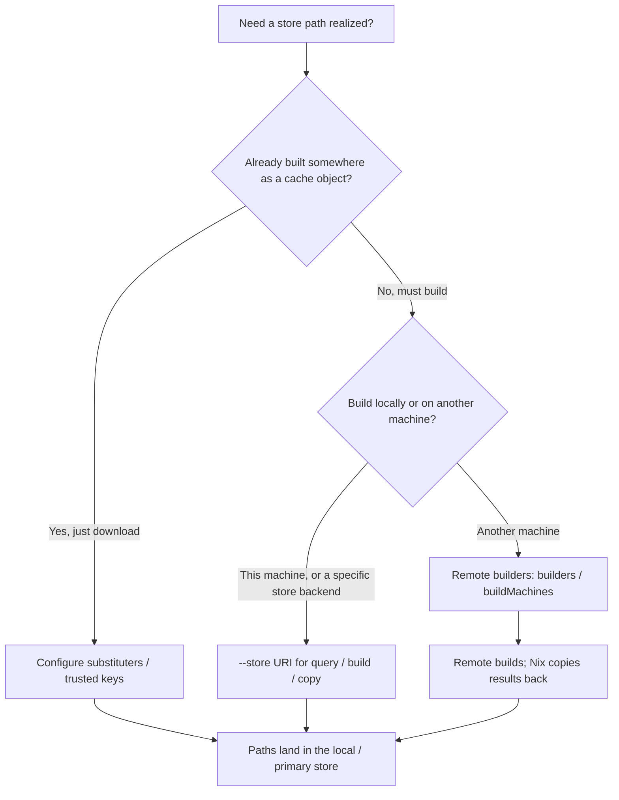

# Store Protocols

## Overview

The **Nix store** is an abstraction: Nix commands talk to a *store implementation* through a URL-like **store URI**, not only to the filesystem tree at `/nix/store`. The same [store path](../02-concepts/store-path.md) string can be queried, copied, or built against different backends—local disk, a daemon socket, an HTTP [binary cache](binary-caches.md), an SSH remote, and others.

Most commands accept `--store <uri>` to pick which backend to use. The special URI `auto` (the default) picks a local store or daemon connection based on permissions and installation layout. Run `nix help-stores` for the authoritative list of store types, URL formats, and per-type settings. (`nix help-stores` is part of the experimental new CLI; interface may change. Content below matches the Nix **2.34** stable manual.)

### Boundaries

This page is the **store URI / protocol chooser**: schemes, `--store`, and how copy/query talk to backends.

- **Not** a `.narinfo` field reference — see [Substitutes and NAR info](substitutes-and-narinfo.md).
- **Not** a full remote-builders howto — see [Remote builders](remote-builders.md) for `builders` / `nix.buildMachines` setup.
- **Not** a full `nix copy` / bundle runbook — see [Nix copy and bundles](../12-deployment-and-infra/nix-copy-and-bundles.md) for flags and packaging outside the store.

## Details

### Choose: `--store` vs substituters vs remote builders

These are three different jobs. Mixing them up is the usual operator mistake.

| Job | Mechanism | Typical config / flag | What happens |
|-----|-----------|----------------------|--------------|
| Talk to **one** store backend for this command | `--store <uri>` (or the default `auto`) | `--store ssh://host`, `--store file:///tmp/cache`, `--store /tmp/root` | Query, build (if capable), or copy **against that store** as the primary target |
| Download **already-built** paths into the local store | Substituters | `substituters` / `extra-substituters` in `nix.conf`, or `--substituters` | On missing paths, Nix fetches NAR + `.narinfo` from cache stores; does **not** schedule remote compiles |
| **Compile** on another machine | Remote builders | `builders` / `--builders`, NixOS `nix.buildMachines` | Derivation runs on the remote; realized paths come back over store protocols |



**Remote builders vs store URIs.** [Remote builders](remote-builders.md) reuse `ssh://` / `ssh-ng://` URIs in `builders` / `--builders`, but that mechanism is **build scheduling**, not the same as pointing every command at a remote store with `--store`. A forwarded build runs on the remote machine; the local Nix then copies realized paths back using store protocols. Substituters in `substituters` are also separate: they are cache stores used for substitution, not the primary `--store` target for most builds.

Trust / substituter refusals (`ignoring untrusted substituter`, missing signatures, unreachable caches) are symptom shortcuts in [FAQ: common errors](../cheatsheets/faq-common-errors.md) and the substituter section of [Troubleshooting](../09-nixos/operations/troubleshooting.md)—not fixed by inventing a different `--store` scheme.

### Store URI syntax

Stores use a URL-like form. Some types use a scheme plus host (`https://cache.nixos.org/`, `ssh://user@host`), others use pseudo-URLs or bare paths (`daemon`, `local`, `/tmp/root`). Append **store settings** as query parameters (`?name=value&…`); the full per-type list is in `nix help-stores`. Common SSH settings include `ssh-key`, `remote-program`, and `remote-store` (which store URI the remote side uses; when unset, Nix treats it as `auto`). Example: `ssh://host?ssh-key=/path/to/key&remote-store=auto`.

### Store types (Nix 2.34 `nix help-stores`)

Schemes and roles:

| Store type | URI format | Typical role |
|------------|------------|--------------|
| Local store | `local`, or an absolute filesystem *root* path | Direct filesystem store access; can build and run (chroot roots need Linux mount/user namespaces) |
| Local daemon store | `daemon`, `unix://` *path* | Talk to the multi-user Nix daemon over a Unix socket (`daemon` ≡ `unix:///nix/var/nix/daemon-socket/socket`) |
| HTTP binary cache | `http://…`, `https://…` | Binary cache over HTTP (usual substituter) |
| Local binary cache | `file://` *path* | Read/write a cache directory on disk |
| S3 binary cache | `s3://` *bucket* | Read/write a cache in S3 or compatible storage |
| SSH store | `ssh://` \[user@\]`host`\[:port\] | Limited remote store access over SSH |
| Experimental SSH store | `ssh-ng://` \[user@\]`host`\[:port\] | Full remote store access (experimental store type; no named feature flag in `nix help-stores`) |
| Experimental mounted SSH store | `mounted-ssh-ng://` \[user@\]`host` | Full remote access plus a local mount of that store; needs `mounted-ssh-store` |
| Experimental local overlay store | `local-overlay` | OverlayFS-backed layered store; needs `local-overlay-store` |
| Dummy store | `dummy://` | In-memory store for evaluation without a durable store |

**Capabilities differ by backend.** Local and daemon stores are **build-capable**: Nix can realize derivations there, subject to sandbox and permission rules. HTTP, file, and S3 binary cache stores are **substitute-oriented**: they expose [NAR info](substitutes-and-narinfo.md) and compressed NARs for paths Nix can copy in, not a general build environment. Cache stores also expose per-store settings such as NAR `compression` (default `xz` on HTTP/file/S3 writes in 2.34; caches may serve `zstd` and others). Field-level `.narinfo` detail belongs on [Substitutes and NAR info](substitutes-and-narinfo.md). Public HTTP mirrors of an S3 bucket are often simpler as `https://…` than as `s3://…` when no credentials are needed.

**SSH vs `ssh-ng`.** Classic `ssh://` gives **limited** remote access (`remote-program` defaults to `nix-store`). Experimental `ssh-ng://` gives **full** remote store access (`remote-program` defaults to `nix-daemon`). Both accept `ssh-key`, `base64-ssh-public-host-key`, `compress`, and `remote-store`. Prefer documented schemes; do not invent protocol RPCs beyond the store-types manual.

### Default selection (`auto`)

When `--store auto`, Nix:

1. Uses the local store `/nix/store` if `/nix/var/nix` is writable by the current user.
2. Else, if `/nix/var/nix/daemon-socket/socket` exists, connects to the daemon on that socket.
3. Else, on Linux only, uses the local chroot store `~/.local/share/nix/root` (created if missing).
4. Else uses the local store `/nix/store`.

### Logical vs physical store path

Each store has a logical `store` setting (usually `/nix/store`). Paths can only be copied between stores that agree on that setting. On-disk layout for the default local store is described in [Nix store layout](nix-store-layout.md). A local store whose *root* is not `/` is a **chroot store**: the logical store dir remains `/nix/store`, while physical paths live under *root* (for example `/tmp/root/nix/store`).

### Common failure modes

Operator-facing mismatches called out in the store manual and `nix help-stores`:

- **`auto` picks the daemon when `/nix/var/nix` is not writable** (see the `auto` rules above). Symptom: builds and store writes go through the multi-user daemon instead of direct local access. Some operations may then require the invoking user to be a [trusted user](../14-security-and-trust/trusted-users.md) (see also [Trusted users and substituters](../05-cli-and-tooling/config/trusted-users-and-substituters.md)).
- **Copy between stores with mismatched logical `store`**. `nix copy --from` / `--to` only works when both sides share the same logical `store` setting (typically `/nix/store`). Non-default or chroot layouts on one side alone produce copy errors even when paths look similar on disk.
- **Wrong SSH scheme (`ssh://` vs `ssh-ng://`)**. Classic `ssh://` is limited; experimental `ssh-ng://` is full access. Using `ssh://` for operations the legacy protocol does not support—some `nix copy` or evaluation paths—can fail with errors about unsupported store operations; switch to `ssh-ng://` when you need full remote store APIs.
- **Experimental store without its feature flag**. `local-overlay` requires `local-overlay-store`; `mounted-ssh-ng://` requires `mounted-ssh-store` (enable via `extra-experimental-features` in `nix.conf`). Opening those URIs without the flag fails immediately. Plain `ssh-ng://` is an experimental *store type* but is not gated by a separate named feature in 2.34 `nix help-stores`.
- **Binary cache URI as a build host**. HTTP, file, and S3 stores are for substitution and signed path copies, not realizing derivations. Using `--store https://…` (or expecting a cache to “build for you”) is the wrong tool—schedule builds with [Remote builders](remote-builders.md) and copy results with store URIs afterward.
- **Trust / substituter symptoms** (wrong keys, untrusted URL, unreachable cache). Look up `ignoring untrusted substituter` and related rows in [FAQ: common errors](../cheatsheets/faq-common-errors.md); network and signature failures in [Troubleshooting — Substituter or network failures](../09-nixos/operations/troubleshooting.md). Fix trust config—do not treat it as a store-scheme problem.

## Examples

**List store types and settings** (authoritative; experimental new CLI, Nix 2.34):

```bash
nix help-stores
```

**Inspect a store backend** (`nix store info` is experimental new CLI):

```bash
nix store info --store auto
nix store info --store ssh://user@build-host
nix store info --store ssh://user@build-host?ssh-key=/path/to/key
nix store info --store ssh-ng://user@build-host
nix store info --store https://cache.nixos.org/
nix store info --store file:///tmp/binary-cache
```

**Query path metadata on a binary cache:**

```bash
nix path-info --json --json-format 1 --store https://cache.nixos.org/ \
  /nix/store/1542dip9i7k4f24y6hqgd04hmvid9hr5-coreutils-9.1
```

(`--json` without `--json-format` is deprecated as of Nix 2.34; prefer `1` or `2`.)

**Copy a path into a local file-backed cache** (`file://` = binary cache directory; a bare path would be a chroot store):

```bash
nix copy --to file:///tmp/binary-cache nixpkgs#hello
```

**Copy a closure onto a remote machine over SSH** (`--substitute-on-destination` / `-s` lets the remote try its own substituters; SSH stores only, Nix 2.34):

```bash
nix copy --substitute-on-destination --to ssh://user@server \
  /run/current-system
```

**Copy a closure from a remote machine** (limited `ssh://` store; use `ssh-ng://` if the legacy protocol lacks an operation):

```bash
nix copy --from ssh://user@build-host?ssh-key=/path/to/key \
  /nix/store/a6cnl93nk1wxnq84brbbwr6hxw9gp2w9-blender-2.79-rc2
```

**Use a chroot local store** (Linux; physical store under `/tmp/root/nix/store`):

```bash
nix run --store /tmp/root nixpkgs#hello
```

**Evaluate without a durable store:**

```bash
nix eval --store dummy:// --expr '1 + 2'
```

## References

- [Nix reference manual — Store](https://nix.dev/manual/nix/stable/store/)
- [Nix reference manual — `nix help-stores`](https://nix.dev/manual/nix/stable/command-ref/new-cli/nix3-help-stores.html) — store types and URI formats (stable → Nix 2.34)
- [Nix reference manual — `nix copy`](https://nix.dev/manual/nix/stable/command-ref/new-cli/nix3-copy.html) — `--from` / `--to`, `--substitute-on-destination` (experimental new CLI, Nix 2.34)

## See also

- [Remote builders](remote-builders.md) — build scheduling vs `--store`
- [Binary caches](binary-caches.md) / [Substitutes and NAR info](substitutes-and-narinfo.md) — substituters and `.narinfo`
- [Nix copy and bundles](../12-deployment-and-infra/nix-copy-and-bundles.md) — `nix copy` / `nix bundle` runbook
- [Nix store layout](nix-store-layout.md) — filesystem `/nix/store`
- [FAQ: common errors](../cheatsheets/faq-common-errors.md) / [Troubleshooting](../09-nixos/operations/troubleshooting.md) — trust and substituter symptoms
- [Trusted users and substituters](../05-cli-and-tooling/config/trusted-users-and-substituters.md) — who may enable caches
