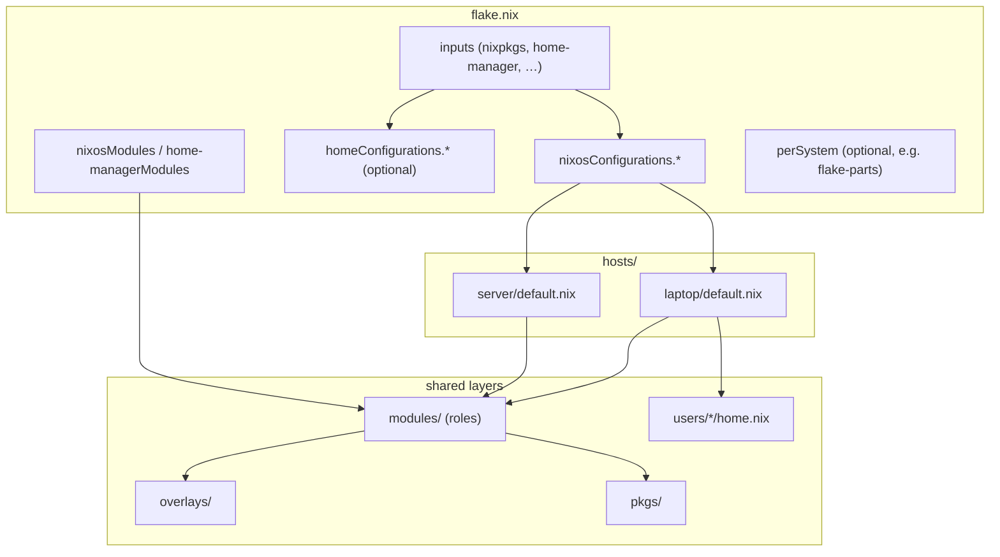

# Config repo layout

## Overview

A **config mono-repo** is a single flake that holds NixOS systems, optional Home Manager profiles, shared modules, and sometimes custom packages. There is no upstream-mandated tree, but most repos converge on the same shape: `flake.nix` at the root, one module per host under `hosts/`, reusable role modules under `modules/`, and flake inputs threaded through `specialArgs` rather than read from `config` during import resolution.

This page describes **folder conventions** and how they connect to [nixosConfigurations](nixos-configurations.md) and [homeConfigurations](home-configurations.md). Output wiring and module semantics are covered in those pages and under [09-nixos](../../09-nixos/README.md).

## Details

**Typical directory layout.**

| Path | Role |
|------|------|
| `flake.nix` | Inputs, `nixosConfigurations`, optional `homeConfigurations`, exported modules |
| `hosts/<hostname>/default.nix` | Per-machine entry module: imports roles + `hardware-configuration.nix`, host-only overrides |
| `modules/` | Shared NixOS (or HM) modules — roles such as `desktop.nix`, `server.nix`, `networking.nix` |
| `users/<name>/home.nix` | Optional per-user Home Manager module when not colocated with the host |
| `overlays/` | Nixpkgs overlays applied from host or shared modules |
| `pkgs/` | Custom packages built with `callPackage` and referenced from modules |

Filenames are conventions, not requirements. The pattern is **thin entry modules** that `imports` focused fragments; see [Imports and profiles](../../09-nixos/configuration/imports-and-profiles.md).

**Repo shape (conceptual).**



**When to split: hosts, roles, or users.**

| Split at | Put here | Use when |
|----------|----------|----------|
| **Host** | `hosts/<hostname>/default.nix` | Machine-specific facts: hostname, disks/bootloader (`hardware-configuration.nix`), NIC names, one-off service toggles, which roles apply on *this* box |
| **Role** | `modules/<role>.nix` | Reusable capability shared by several hosts: desktop stack, NAS services, VPN, monitoring agent — anything two machines might import unchanged |
| **User** | `users/<name>/home.nix` | Dotfiles, editor/shell config, per-user packages — owned by a login, not by hardware; may be standalone HM or embedded in a host via `home-manager.users` |

Rule of thumb: if removing a machine from the fleet would delete the setting, it belongs in **hosts/**; if adding a second machine would copy-paste the same block, promote it to **modules/**; if it follows the person across laptops and servers, put it under **users/**.

**Wiring hosts in `flake.nix`.** Each machine gets a `nixosConfigurations.<host>` entry. Pass flake inputs into every module via `specialArgs` so host and role modules can use `inputs` without importing the flake root:

```nix
nixosConfigurations.laptop = nixpkgs.lib.nixosSystem {
  modules = [ ./hosts/laptop/default.nix ];
  specialArgs = { inherit inputs; };
};
```

Do not try to pass inputs by reading merged `config` inside `imports` — import lists must be static (see failure modes below).

**`specialArgs` vs `_module.args`.** These solve different layers of the module graph:

| Mechanism | Set from | Visible in | Typical use |
|-----------|----------|------------|-------------|
| `specialArgs` | `nixosSystem` / `homeManagerConfiguration` (`extraSpecialArgs`) | Every module in that configuration | Flake `inputs`, `self`, paths that must appear in `imports` |
| `_module.args` | Inside any module’s `config` | Descendant modules in the same evaluation | Values computed inside the module graph (shared `cfg`, internal helpers) |

`specialArgs` is not overridable via the module system; `_module.args` merges like other module options. For flake inputs and static import paths, prefer `specialArgs`. Use `_module.args` only when the value must come from within the module fixpoint. See [writing a module](../../09-nixos/modules/writing-a-module.md).

**Host entry module.** `hosts/<hostname>/default.nix` typically:

1. `imports` shared role modules from `modules/` (and optionally `home-manager.nixosModules.home-manager`).
2. `imports` `./hardware-configuration.nix` (generated at install; disk and bootloader specifics stay here).
3. Sets only what differs for this host — hostname, networking, one-off service toggles.

Role modules encode **capabilities** (desktop, NAS, hypervisor); the host file picks which roles apply. Multiple hosts import the same `modules/server.nix` but differ in hostname and hardware fragments.

**Overlays and custom packages.** Apply overlays from a host or shared role so every host that imports the role sees the same package set:

```nix
# modules/common.nix (or a host entry)
{ ... }: {
  nixpkgs.overlays = [
    (import ../overlays/default.nix)
  ];
}
```

Keep **one** `nixpkgs` input in `flake.nix` and align downstream inputs with `inputs.<name>.follows = "nixpkgs"` so `flake.lock` does not pull a second Nixpkgs checkout. Custom derivations under `pkgs/` are usually built via `pkgs.callPackage` inside modules after overlays are applied.

**Home Manager placement.** Two common patterns:

1. **Standalone** — `homeConfigurations.<user>` in `flake.nix`, modules under `users/<name>/home.nix`. Use on non-NixOS hosts or when dotfiles evolve on a separate cadence. See [homeConfigurations](home-configurations.md).
2. **NixOS-embedded** — import `home-manager.nixosModules.home-manager` in the host module list and set `home-manager.users.<user> = ./users/<name>/home.nix` (or an inline module). User env rebuilds with `nixos-rebuild`, not `home-manager switch`.

Both can coexist in one repo for different users or machines. When embedded, set `home-manager.useGlobalPkgs = true` and `home-manager.useUserPackages = true` so Home Manager reuses the system `pkgs` and user profile layout; without `useGlobalPkgs`, HM builds against its own `pkgs` and can drift from system packages.

**Exporting reusable modules.** Flakes can expose `nixosModules.<name>` and `home-managerModules.<name>` so other flakes import your roles without copying files:

```nix
outputs = { ... }: {
  nixosModules.desktop = ./modules/desktop.nix;
  nixosModules.server = ./modules/server.nix;
};
```

Reference them in the same repo (`imports = [ inputs.self.nixosModules.desktop ]`) or from downstream flakes. Exported modules are plain module paths or functions — same semantics as inline `imports`.

**Deploy tools.** Colmena, Morph, nixinate, and similar tools read `nixosConfigurations.<name>` from your flake outputs and build or activate the matching `.config.system.build.toplevel`. Layout under `hosts/` does not change the deploy interface: the flake output name is the stable address (`.#server`, `.#laptop`).

**Packages and checks (brief).** Mono-repos often also define `packages`, `apps`, or `checks` per system. Frameworks such as [flake-parts](../../13-implementations/module-ecosystems/flake-parts.md) expose these via `perSystem` without hand-rolling `eachSystem` in `flake.nix`; the hosts/modules/users split stays the same. See that page for `mkFlake` and `perSystem` details — not duplicated here.

**Framework alternatives.** The same decomposition problem — many hosts, shared roles, several output keys — is solved with scaffolds that map directories to outputs:

- [flake-parts](../../13-implementations/module-ecosystems/flake-parts.md) — module-system evaluation of `outputs`, `perSystem` for packages and checks.
- [Snowfall](../../13-implementations/community-frameworks/snowfall.md), [Blueprint](../../13-implementations/community-frameworks/blueprint-and-others.md) — opinionated folder → output conventions with a thin `flake.nix`.

Use a framework when manual `flake.nix` glue becomes noisy; the underlying layout (hosts, modules, users) stays recognizable.

## Boundaries

This page covers **where files live** and how folders connect to flake outputs. It does not define:

- Individual option trees or service modules (see [09-nixos](../../09-nixos/README.md) and [configuration.nix](../../09-nixos/configuration/configuration-nix.md)).
- Full `nixosSystem` / `homeManagerConfiguration` API tables ([nixosConfigurations](nixos-configurations.md), [homeConfigurations](home-configurations.md)).
- `perSystem`, `mkFlake`, or flake-parts module options ([flake-parts](../../13-implementations/module-ecosystems/flake-parts.md)).
- Remote deploy flags, secrets, or disk partitioning ([remote deploy](../../09-nixos/operations/remote-deploy.md), [secrets strategies](../../09-nixos/configuration/secrets-strategies.md)).

## Failure modes

- **Conditional `imports` from `config`** — `imports` is resolved before the module fixpoint; you cannot `import` a path chosen from `config.services.*.enable`. Use `mkIf` on options inside static modules, or separate host entry files per role combination.
- **Inputs only via `config`** — flake inputs belong in `specialArgs` / `_module.args`, not reconstructed from option values after merge.
- **Duplicate Nixpkgs pins** — forgetting `inputs.home-manager.inputs.nixpkgs.follows = "nixpkgs"` (or similar) pulls a second Nixpkgs revision into the lockfile; system and HM builds may disagree on package versions.
- **HM / NixOS package drift** — embedded Home Manager without `useGlobalPkgs` evaluates against a separate `pkgs` than NixOS; `environment.systemPackages` and `home.packages` can install different revisions of the same name.
- **One giant `configuration.nix`** — hard to review, merge-conflict prone, and difficult to reuse across hosts. Split by role and import.
- **Hostname scattered in role modules** — `networking.hostName` belongs in the host entry; role modules should stay hostname-agnostic so they compose on any machine.

## Examples

Illustrative mono-repo tree:

```
.
├── flake.nix
├── hosts/
│   ├── laptop/
│   │   ├── default.nix
│   │   └── hardware-configuration.nix
│   └── server/
│       ├── default.nix
│       └── hardware-configuration.nix
├── modules/
│   ├── common.nix          # overlays + baseline
│   ├── desktop.nix
│   └── server.nix
├── users/
│   └── alice/
│       └── home.nix
├── overlays/
│   └── default.nix
└── pkgs/
    └── my-cli/
        └── default.nix
```

Multi-host `flake.nix` with shared inputs, two `nixosConfigurations`, exported module, and standalone HM:

```nix
{
  inputs = {
    nixpkgs.url = "github:NixOS/nixpkgs/nixos-26.05";
    home-manager.url = "github:nix-community/home-manager/release-26.05";
    home-manager.inputs.nixpkgs.follows = "nixpkgs";
  };

  outputs = { nixpkgs, home-manager, ... }@inputs: {
    nixosConfigurations.laptop = nixpkgs.lib.nixosSystem {
      specialArgs = { inherit inputs; };
      modules = [ ./hosts/laptop/default.nix ];
    };

    nixosConfigurations.server = nixpkgs.lib.nixosSystem {
      specialArgs = { inherit inputs; };
      modules = [ ./hosts/server/default.nix ];
    };

    nixosModules.desktop = ./modules/desktop.nix;
    nixosModules.server = ./modules/server.nix;

    homeConfigurations.alice = home-manager.lib.homeManagerConfiguration {
      pkgs = nixpkgs.legacyPackages.x86_64-linux;
      extraSpecialArgs = { inherit inputs; };
      modules = [ ./users/alice/home.nix ];
    };
  };
}
```

Shared overlays via a role module:

```nix
# modules/common.nix
{ ... }: {
  nixpkgs.overlays = [
    (import ../overlays/default.nix)
  ];
  environment.systemPackages = [ pkgs.my-cli ];
}
```

Server host — same roles pattern, different imports and hostname:

```nix
# hosts/server/default.nix
{ inputs, ... }: {
  imports = [
    ../../modules/common.nix
    ../../modules/server.nix
    ./hardware-configuration.nix
    inputs.home-manager.nixosModules.home-manager
  ];
  networking.hostName = "server";
}
```

Laptop host with embedded Home Manager:

```nix
# hosts/laptop/default.nix
{ inputs, ... }: {
  imports = [
    ../../modules/common.nix
    inputs.self.nixosModules.desktop
    ./hardware-configuration.nix
    inputs.home-manager.nixosModules.home-manager
  ];
  networking.hostName = "laptop";
  home-manager.useGlobalPkgs = true;
  home-manager.useUserPackages = true;
  home-manager.users.alice = ../../users/alice/home.nix;
}
```

Deploy: `sudo nixos-rebuild switch --flake .#laptop` or `.#server`. Standalone HM for the same user: `home-manager switch --flake .#alice`.

## References

- [nix.dev — Flakes tutorial](https://nix.dev/tutorials/flakes.html) — inputs, outputs, and `nixosConfigurations` basics
- [flake.parts](https://flake.parts/) — module-system flake outputs
- [Home Manager manual — Nix Flakes](https://nix-community.github.io/home-manager/index.xhtml#sec-flakes) — standalone and NixOS-module integration (experimental)

## See also

- [Inputs and outputs](../anatomy/inputs-and-outputs.md) — conventional flake output keys
- [nixosConfigurations](nixos-configurations.md) — `nixosSystem` wiring and rebuild
- [homeConfigurations](home-configurations.md) — standalone Home Manager flakes
- [Imports and profiles](../../09-nixos/configuration/imports-and-profiles.md) — static `imports` and splitting configuration
- [configuration.nix](../../09-nixos/configuration/configuration-nix.md) — primary machine configuration file
- [flake-parts](../../13-implementations/module-ecosystems/flake-parts.md) — `mkFlake` and `perSystem`
- [Dotfiles patterns](../../10-home-and-user/home-manager/dotfiles-patterns.md) — organizing user-level modules
