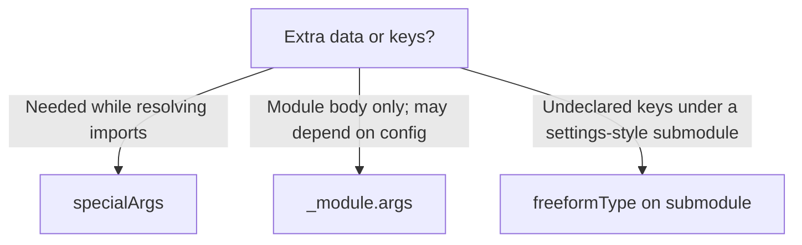

# Module system internals

## Overview

[Module system](module-system.md) covers the author-facing shape of modules; this page is the **evaluator layer**: what `lib.evalModules` does with imports, option merge, unmatched definitions, and injected arguments. NixOS, Home Manager, nix-darwin, and custom tooling all call the same nixpkgs implementation in [`lib/modules.nix`](https://github.com/NixOS/nixpkgs/blob/master/lib/modules.nix).

The important split for arguments is **import time vs option merge time**. Values needed while resolving `imports` must come from `specialArgs`; values needed only when module bodies run (typically `pkgs`, custom libraries) belong in `_module.args`. **Freeform** submodules relax strict option-name checking so `settings`-style maps can accept extra keys. **`extendModules`** and **`class`** let you reuse or constrain evaluations without re-running the whole import graph from scratch.

## Boundaries

**In scope:** `lib.evalModules` behavior—import collection, option/config merge, `_module.check` / `checkUnmatched`, `specialArgs` vs `_module.args`, `freeformType`, `class`, and `extendModules`.

**Out of scope / what this page is not:**

- A tutorial for writing your first module (start with [Writing a module](../modules/writing-a-module.md) and [Module system](module-system.md)).
- A Home Manager (or NixOS) **option catalog**—use [search.nixos.org/options](https://search.nixos.org/options) and Home Manager’s option docs for concrete `services.*` / `home.*` keys.
- Flake folder layout and host wiring—see [Config repo layout](../../07-flakes/workflows/config-repo-layout.md) (including its `specialArgs` discussion).

## Details

**`lib.evalModules`.** Callers pass `{ modules = [ … ]; specialArgs ? { }; class ? null; prefix ? [ ]; }`. The function collects modules recursively (`collectModules`), merges option declarations, merges config definitions by type, and returns `{ config, options, extendModules, type, class, _module, … }`. Top-level `config` has `_module` stripped; internal `_module` metadata is exposed separately. The deprecated top-level `args` and `check` arguments are translated into synthetic modules setting `_module.args` and `_module.check`.

**Declared vs freeform config.** After merge, `config` is built from two buckets:

| Bucket | Source | When |
|--------|--------|------|
| Declared | Definitions whose path matches a merged option | Always; types and merge functions apply |
| Freeform | Definitions with **no** matching option | Only if `_module.freeformType` is set |

If `freeformType` is `null`, any unmatched definition is an error (when checking is on). If it is set (e.g. `types.attrsOf types.str`), unmatched paths merge through that type’s merge function and land in `config` alongside declared options.

**`freeformType`.** Not a member of `lib.types`—it is a **submodule attribute** (`freeformType = someType;` inside `types.submodule { … }` or `types.submoduleWith { … }`). The submodule’s internal merge lifts it to `_module.freeformType`. Declared child options keep normal typing; extra keys under the same submodule path merge as `someType`. Nixpkgs uses this heavily for `settings = { … }` blocks where upstream accepts an open key set. Prefer freeform only inside submodules; at the root, undeclared top-level keys usually indicate a typo. See [Options and types](options-and-types.md).

**`_module.check`.** Internal boolean (default `true`). When enabled and `freeformType` is `null`, the evaluator runs `checkUnmatched` on definitions that did not bind to any option. The error names the bad path, lists defining locations, and may suggest nearby option names (Levenshtein). Turn checking off only for deliberate open schemas or incremental tooling—not to silence typos in production configs. Setting `freeformType` is the supported way to allow extra keys in a subtree.

**`specialArgs` vs `_module.args`.**

| Mechanism | Available when | Typical use |
|-----------|----------------|-------------|
| `specialArgs` on `evalModules` | Module import resolution **and** module bodies | Flake `inputs`, `modulesPath`, paths referenced in `imports` |
| `config._module.args` | Module bodies only (after args are merged) | `pkgs`, overlays, helpers injected into every module function |

`imports` must be static—it cannot branch on merged `config`. Anything a module needs **inside** an `imports` list must therefore be in `specialArgs` (or a literal path). NixOS wires `modulesPath` and default `pkgs` this way; flake `nixosSystem` passes `specialArgs = { inherit inputs; }` so modules can import from inputs at eval time. `_module.args` uses `lazyAttrsOf` so unevaluated arguments (e.g. a heavy `pkgs` import) are not forced unless a module reads them. Submodule evaluations get their own `_module.args` scope; they do not inherit sibling or parent args except the `name` binding. Basics: [Module system](module-system.md), [Writing a module](../modules/writing-a-module.md). For flake host wiring of `inputs` via `specialArgs`, see [Config repo layout](../../07-flakes/workflows/config-repo-layout.md).

**Choosing `specialArgs`, `_module.args`, or `freeformType`.**



| Situation | Prefer | Why |
|-----------|--------|-----|
| Path or flake input used in `imports = [ … ]` | `specialArgs` | Import lists are resolved before the config fixpoint; `_module.args` is not available yet |
| `pkgs`, helpers, or values computed inside the module graph | `_module.args` | Merges like other options; lazy; not needed during import collection |
| Open key set next to a few typed child options (`settings.*`) | `freeformType` on that submodule | Extra keys merge via the freeform type; declared children stay typed |
| Typo at top level of a NixOS/HM config | Neither freeform nor `_module.check = false` | Leave checking on; declare the option or fix the name |

**`class`.** Optional string nominal type. When `evalModules` is called with non-null `class`, imported modules must have matching `_class` (or null). Mixing NixOS-class modules into a Home Manager evaluation, for example, fails at import with an explicit class mismatch. Ecosystem entry points set `class` consistently (`"nixos"`, `"homeManager"`, etc.).

**`extendModules`.** The result of `evalModules` includes `extendModules = args: evalModules (previousArgs // { modules = oldModules ++ args.modules; specialArgs = oldSpecialArgs // args.specialArgs; … })`. Use it to layer more modules or `specialArgs` onto an existing evaluation without discarding the original module list—common in library code that returns a partial configuration consumers extend. Each extension reuses a fresh internal `_module` option module to avoid conflicts. **`type`** on the result is a `types.submoduleWith` wrapping the same `modules`, `specialArgs`, and `class`, so nested option types can embed a whole sub-evaluation.

**Relation to [config vs options](config-vs-options.md).** The evaluator never treats bare `config` keys as options; declarations must live under `options`. Freeform submodules are the exception for *values*: extra keys under a submodule path are values merged by `freeformType`, not new option declarations. Priority helpers (`lib.mkIf`, `lib.mkMerge`, …) apply during definition merge—see [mkIf, mkMerge, mkOrder](../modules/mkIf-mkMerge-mkOrder.md).

## Failure modes

| Symptom | Likely cause | What to do |
|---------|--------------|------------|
| `The option '…' does not exist` (from `checkUnmatched`) | Definition path has no matching option; `_module.check` is true and `freeformType` is `null` | Fix the path/typo, declare the option, or (only inside a settings submodule) set `freeformType`. Do not turn off `_module.check` to hide typos. |
| Class mismatch: module `…` (class: `"…"`) cannot be imported into evaluation that expects class `"…"` | `evalModules` / entry point set non-null `class`; imported module’s `_class` disagrees | Import a module for that ecosystem (`"nixos"` vs `"homeManager"`, etc.), or align `_class` for custom evaluations. |
| Missing argument / forced use of `_module.args` while resolving structure | Value needed in `imports` (or early) but only provided via `_module.args` | Pass it in `specialArgs` (e.g. `inputs`, `modulesPath`). See [Config repo layout](../../07-flakes/workflows/config-repo-layout.md). |
| Infinite recursion; error context mentions `config` in `imports` | `imports` depends on merged `config` | Keep `imports` static; import unconditionally and gate effects with `mkEnableOption` + [`mkIf`](../modules/mkIf-mkMerge-mkOrder.md). |
| Infinite recursion around option conditionals | Plain `if config.x then { … } else { }` that also defines paths feeding `config.x` | Use [`lib.mkIf`](../modules/mkIf-mkMerge-mkOrder.md) so the condition is delayed into definition merge. |
| Typo accepted as a freeform key | `freeformType` on a broad attrset (or checking disabled) swallows an unintended name | Prefer freeform only on intentional `settings`-style submodules; keep root evaluation strict so typos still fail `checkUnmatched`. |

## Examples

Minimal standalone evaluation: `specialArgs` for import-time context, `_module.args` for `pkgs`, and `freeformType` for an open settings map.

```nix
# eval.nix — run: nix-instantiate --eval eval.nix -A config.services.demo.settings
let
  nixpkgs = builtins.fetchTarball "https://github.com/NixOS/nixpkgs/tarball/nixos-26.05";
  pkgs = import nixpkgs { config = {}; overlays = []; };
in
pkgs.lib.evalModules {
  specialArgs = { inherit pkgs; };
  modules = [
    ({ config, ... }: { config._module.args = { inherit pkgs; }; })
    ({ lib, pkgs, ... }: {
      options.services.demo.settings = lib.mkOption {
        type = lib.types.submodule {
          freeformType = lib.types.attrsOf lib.types.str;
          options.enable = lib.mkEnableOption "demo service";
        };
        default = { };
      };
      config.services.demo.settings = {
        enable = true;
        upstreamFlag = "on"; # undeclared; allowed via freeformType
      };
    })
  ];
}
```

Without `freeformType`, `upstreamFlag` would fail `_module.check` with an “option does not exist” error. Without `specialArgs` / `_module.args`, modules that reference `pkgs` in `imports` or the function head would not receive it.

For the author-facing module shape (options + `mkIf` config, not a full `evalModules` harness), see the vault fixture [minimal-module.nix](../../meta/examples/minimal-module.nix).

## References

- [Nixpkgs manual — Module system](https://nixos.org/manual/nixpkgs/stable/#module-system) — `lib.evalModules`, `_module.*` options
- [nix.dev — Module system deep dive](https://nix.dev/tutorials/module-system/deep-dive.html) — `evalModules`, `_module.args`, type errors
- [`lib/modules.nix`](https://github.com/NixOS/nixpkgs/blob/master/lib/modules.nix) — `evalModules`, `freeformConfig`, `checkUnmatched`, `extendModules`, `class`
- [noogle — `lib.evalModules`](https://noogle.dev/f/lib/evalModules) — signature and call sites in nixpkgs

## See also

- [Module system](module-system.md) — module shape, merge overview, static imports
- [Options and types](options-and-types.md) — `mkOption`, submodules, `freeformType` in schemas
- [config vs options](config-vs-options.md) — declarations vs definitions
- [mkIf, mkMerge, mkOrder](../modules/mkIf-mkMerge-mkOrder.md) — definition merge priorities
- [Writing a module](../modules/writing-a-module.md) — authoring workflow and argument injection
- [Config repo layout](../../07-flakes/workflows/config-repo-layout.md) — flake `specialArgs` / host wiring
- [FAQ: common errors](../../cheatsheets/faq-common-errors.md) — unmatched options / infinite recursion symptoms
- [Getting help and community](../../15-history-and-governance/getting-help-and-community.md) — when to ask upstream
