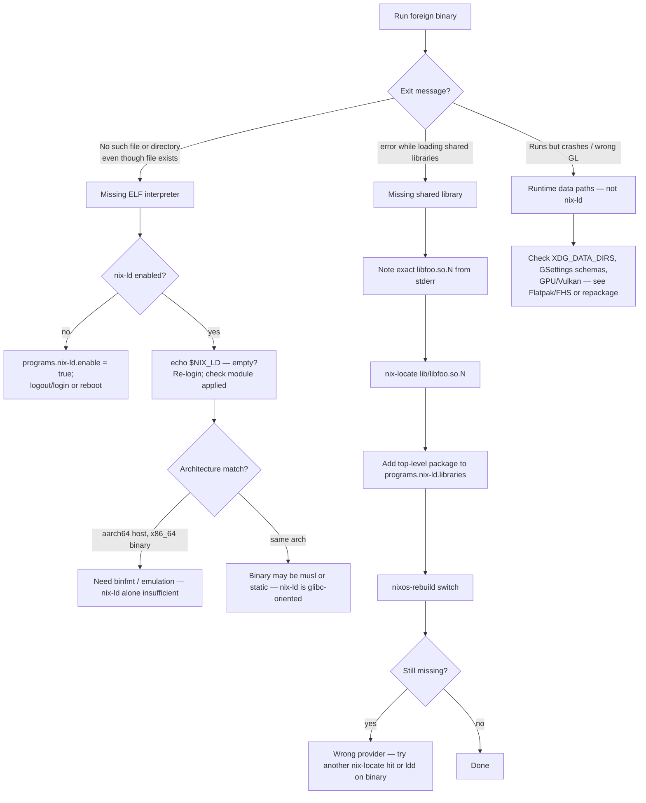

# nix-ld and foreign binaries

## Overview

NixOS does not ship a traditional FHS dynamic linker at paths such as `/lib64/ld-linux-x86-64.so.2`. Prebuilt Linux binaries from vendors (`.deb` extracts, AppImages, language-ecosystem downloads, game launchers) often hardcode those paths and expect libraries under `/usr/lib`. **`programs.nix-ld`** installs a shim at the usual loader location; it forwards execution to the real linker from nixpkgs and maps `NIX_LD_LIBRARY_PATH` into `LD_LIBRARY_PATH` so many unpatched x86_64 glibc binaries run without a full per-command FHS environment. Integrated in nixpkgs since NixOS 22.05, it is a pragmatic desktop convenience — not a substitute for packaging in nixpkgs when you need reproducibility, updates, or policy control.

## Details

**Why foreign binaries fail.** On typical Linux distributions, ELF executables point at a system-wide link loader and resolve shared libraries from fixed hierarchy paths. NixOS stores each package under `/nix/store` with its own interpreter and `RPATH`; there is no global `/lib` tree. An unpatched upstream binary therefore often fails immediately with “No such file or directory” (missing interpreter) or “error while loading shared libraries” (missing `.so`).

**What nix-ld does.** [nix-ld](https://github.com/nix-community/nix-ld) places a small loader at `/lib64/ld-linux-x86-64.so.2` (and the 32-bit analogue on multilib setups). That shim reads `NIX_LD` (which dynamic linker in the store to use) and `NIX_LD_LIBRARY_PATH` (colon-separated library search paths), then execs the real loader with `LD_LIBRARY_PATH` set accordingly. The NixOS module sets those variables system-wide when enabled. Per-arch overrides exist as `NIX_LD_{system}` and `NIX_LD_LIBRARY_PATH_{system}` (system with dashes replaced by underscores, e.g. `x86_64_linux`).

**`programs.nix-ld` options.** `programs.nix-ld.enable = true` turns on the shim and wires default loader paths. `programs.nix-ld.libraries` lists nixpkgs packages whose `lib/` outputs are merged into `NIX_LD_LIBRARY_PATH` — add packages here when a binary complains about a missing shared object; do not rely on `environment.systemPackages` alone for unpackaged binaries. `programs.nix-ld.package` selects the shim implementation (upstream defaults to the maintained `nix-ld-rs` merge). After the first enable, log out and back in (or reboot) so session environment picks up the new variables; library list changes apply on `nixos-rebuild switch`. Disable temporarily with `unset NIX_LD` in a shell.

**Finding missing libraries.** Run the binary and read the loader error, then map the `.so` name to a nixpkgs attribute — [nix-index / comma](../../05-cli-and-tooling/adjacent-tools/nix-index-comma.md) (`nix-locate`) is the usual workflow. Add the providing package to `programs.nix-ld.libraries`, not only to `environment.systemPackages`.

**Not security isolation.** Like [FHS wrappers](flatpak-and-fhs.md) (`buildFHSEnv`, `steam-run`), nix-ld only fixes filesystem expectations for the dynamic linker. The foreign process runs on the host with your user privileges and can read anything that user can. Trust the binary source; prefer [Flatpak](flatpak-and-fhs.md) when you want sandboxing and runtime updates.

### Choosing an approach

| | **nix-ld** | **Flatpak** | **`buildFHSEnv` / `steam-run`** | **Repackage in nixpkgs** |
|--|------------|-------------|----------------------------------|---------------------------|
| **Scope** | System-wide loader shim + library path | Per-app sandbox + remote runtime | Per-command synthetic `/usr` tree | One derivation per program |
| **Isolation** | None — host user privileges | Sandboxed (Flatpak/bwrap) | FHS view only; host largely visible | Same as any nixpkgs package |
| **Setup cost** | `enable` + grow `libraries` list | `services.flatpak` + portals + remotes | Custom derivation or `steam-run` wrapper | Patchelf, deps, tests, maintenance |
| **Updates** | Rebuild when nixpkgs changes; vendor binary manual | `flatpak update` | Rebuild wrapper | `nixos-rebuild` / channel bump |
| **Best for** | Many unpatched x86_64 binaries; npm/pip prebuilt helpers; quick vendor tests | Desktop apps on Flathub; sandboxed third-party software | Installers (`.run`), one-off commands, Steam ecosystem | Production, CI, shared machines, license tracking |
| **Weak fit** | Integrity-checked games, musl binaries, heavy policy control | Apps not published as Flatpaks | setuid binaries inside env; nested sandbox tools | One-off throwaway experiments |

Community helpers such as **nix-alien** overlap nix-ld use cases by auto-mapping `.deb`/`.rpm` dependencies; evaluate maturity per package before relying on them in production.

### Troubleshooting flow

Work through symptoms in order — interpreter and library failures look similar but need different fixes.



**Interpreter missing** — the kernel cannot execute the ELF because the `PT_INTERP` path (e.g. `/lib64/ld-linux-x86-64.so.2`) does not exist. Enable nix-ld and ensure `NIX_LD` is set in the session (first enable requires logout/login). If the binary targets a different architecture than the host, nix-ld does not substitute for QEMU/binfmt.

**Library missing** — the shim runs but `ld.so` cannot find a `.so` named in the error. Use `nix-locate` on the store path pattern (`lib/libname.so*`), add the **providing package** to `programs.nix-ld.libraries`, rebuild. Installing the package to `environment.systemPackages` alone does not add its `lib/` to `NIX_LD_LIBRARY_PATH`.

**Wrong library in the list** — two nixpkgs attributes may ship similarly named `.so` files (e.g. different major versions). Symptoms include segfaults or symbol-not-found errors after the loader succeeds. Confirm with `ldd` on the binary (when it gets far enough) or `LD_DEBUG=libs` and swap the library provider.

**Forgot logout after enable** — `nixos-rebuild switch` applies the module, but existing graphical sessions and terminals may not inherit `NIX_LD` / `NIX_LD_LIBRARY_PATH` until you log out and back in or open a new login session. Symptom: `echo $NIX_LD` is empty while the option is enabled.

**aarch64 vs x86_64** — nix-ld installs the loader path appropriate to the host (`ld-linux-aarch64.so.1` on aarch64, `ld-linux-x86-64.so.2` on x86_64). Running an x86_64 ELF on aarch64 (or vice versa) requires the corresponding binfmt/emulation setup; nix-ld only bridges the FHS loader path for the binary’s native architecture. Cross-arch vendor downloads are a common silent mismatch.

**Security and trust** — nix-ld deliberately does not sandbox. Any binary you run can access your home directory, SSH keys, and secrets visible to your user. Only run binaries from sources you trust; for untrusted third-party software prefer Flatpak or a dedicated user/VM. Setting `LD_LIBRARY_PATH` globally breaks Nix-built binaries with RPATH; that is why nix-ld uses `NIX_LD_LIBRARY_PATH` and rewrites it only inside the shim.

**Foreign distros vs NixOS.** On Debian, Fedora, and similar hosts, the system already provides FHS loaders; Nix coexists without nix-ld. The mismatch is specific to NixOS as the host OS — see [Nix on other distros](../../10-home-and-user/nix-on-other-distros.md).

**Pro audio note (optional).** Desktop audio on NixOS usually goes through [PipeWire and audio](audio-pipewire.md). For pro-audio low-latency stacks, some users add the community **musnix** overlay alongside PipeWire/JACK; treat it as an optional, channel-specific add-on rather than core nix-ld documentation.

### Boundaries

**nix-ld is a good fit when:**

- You need many different unpatched glibc binaries without wrapping each one.
- Language ecosystems (Node, Python venvs with native wheels, Rust `cargo install` binaries) download prebuilt helpers that expect `/lib64/ld-linux-x86-64.so.2`.
- You are evaluating a vendor binary before investing in a nixpkgs derivation.

**Prefer something else when:**

- The app is available as a Flatpak with acceptable sandboxing — use [Flatpak and FHS](flatpak-and-fhs.md).
- You need a single installer or game launcher with a large closed dependency set — `buildFHSEnv` or `steam-run` (see [Gaming: Steam and Proton](gaming-steam-proton.md)) may be simpler than growing `libraries` indefinitely.
- You need reproducibility, CI, or multi-user policy — repackage with `autoPatchelfHook` or a proper derivation.
- The binary is **musl-linked** or **static** — nix-ld targets glibc dynamic linking via the standard FHS loader paths.
- The program verifies its own integrity or refuses to run under a shim — repackage or use an FHS env the vendor accepts.
- You need **setuid** helpers inside an FHS tree — `buildFHSEnv` subshell limitations apply; nix-ld does not help setuid.
- **Nix-built** interpreters (e.g. `pkgs.python3`) do not read `NIX_LD_LIBRARY_PATH`; set `LD_LIBRARY_PATH` in a wrapper for those cases (see upstream nix-ld FAQ).

## Examples

Enable the shim with a small library set (extend as binaries demand):

```nix
{ pkgs, ... }: {
  programs.nix-ld = {
    enable = true;
    libraries = with pkgs; [
      stdenv.cc.cc
      zlib
      openssl
    ];
  };
}
```

Locate a missing library and add the provider:

```bash
./vendor-binary
# error while loading shared libraries: libxkbcommon.so.0: cannot open shared object file

nix-locate lib/libxkbcommon.so.0
# → add libxkbcommon (or xorg.libxkbcommon on your channel) to programs.nix-ld.libraries
```

**AppImage / vendor binary workflow** — download, make executable, run, iterate on `libraries`:

```bash
# 1. Fetch upstream AppImage (example)
curl -LO https://example.com/SomeApp-x86_64.AppImage
chmod +x SomeApp-x86_64.AppImage

# 2. First run — read stderr
./SomeApp-x86_64.AppImage
# ./SomeApp-x86_64.AppImage: error while loading shared libraries: libfuse.so.2: ...

# 3. Map .so → nixpkgs attribute
nix-locate lib/libfuse.so.2
# fuse.out  →  add pkgs.fuse to programs.nix-ld.libraries

# 4. Rebuild and retry (new login not needed for library-only changes)
sudo nixos-rebuild switch
./SomeApp-x86_64.AppImage

# 5. Repeat for each missing library; AppImages may also need
#    libGL, gtk3, nss, etc. — same nix-locate loop
```

Some AppImages require `pkgs.appimage-run` or FUSE configuration instead of raw execution; if the image mounts but the inner binary still fails on `.so` names, the nix-locate → `libraries` loop is the same.

Per-shell override in a `shell.nix` (development without changing system config):

```nix
{ pkgs ? import <nixpkgs> {} }:
pkgs.mkShell {
  NIX_LD = pkgs.stdenv.cc.bintools.dynamicLinker;
  NIX_LD_LIBRARY_PATH = pkgs.lib.makeLibraryPath [
    pkgs.stdenv.cc.cc
    pkgs.openssl
  ];
}
```

## References

- [NixOS options — `programs.nix-ld`](https://search.nixos.org/options?query=programs.nix-ld) — `enable`, `libraries`, `package`
- [nix-community/nix-ld](https://github.com/nix-community/nix-ld) — shim behaviour, `NIX_LD` / `NIX_LD_LIBRARY_PATH` semantics, FAQ
- [NixOS Wiki — Nix-ld](https://wiki.nixos.org/wiki/Nix-ld) — enablement patterns and troubleshooting (secondary)

## See also

- [Flatpak and FHS](flatpak-and-fhs.md) — sandboxed apps vs `buildFHSEnv` / `steam-run`
- [Gaming: Steam and Proton](gaming-steam-proton.md) — Steam’s FHS environment and `steam-run`
- [PipeWire and audio](audio-pipewire.md) — default desktop audio stack
- [nix-index / comma](../../05-cli-and-tooling/adjacent-tools/nix-index-comma.md) — find which package owns a `.so` or binary
- [Nix on other distros](../../10-home-and-user/nix-on-other-distros.md) — no nix-ld needed when Nix is not the host OS
