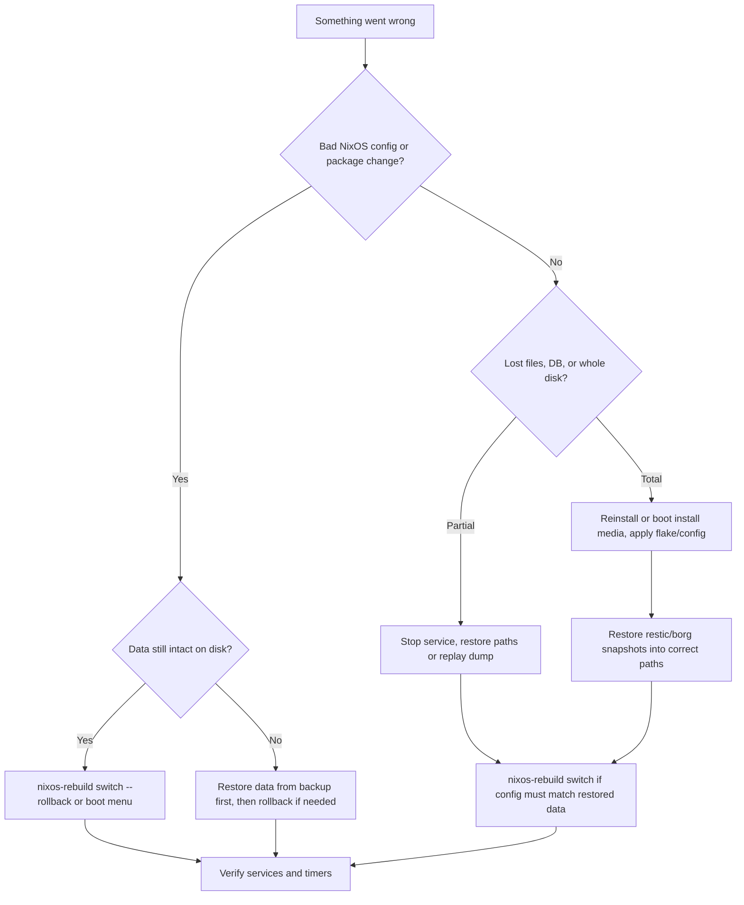

# Backups and restore

## Overview

NixOS [generations](../../02-concepts/generation.md) and [rollbacks](rollbacks.md) recover the **system closure**—packages, `/etc`, systemd units, and other paths declared in configuration—not arbitrary runtime state. User data under `/home`, database files in `/var/lib`, and application state you never put in `configuration.nix` survive or die independently of `nixos-rebuild switch --rollback`.

Treat **system rollback** and **data backup** as complementary: generations undo a bad config; backups restore files and databases after disk loss, ransomware, or operator error. On [impermanent](../configuration/impermanence.md) hosts the split is sharper—rebuild recreates undeclared paths on every boot, so anything on your persist list that matters off-box needs an explicit backup job.

## Details

### Generation rollback vs data backup

Use this flow when deciding what to do after a problem:



| Situation | Tool | What it restores |
|-----------|------|------------------|
| Broken `configuration.nix`, wrong channel bump | Generation rollback | System closure, `/etc`, declared users |
| Deleted `/home`, corrupted Postgres data dir | Restic / Borg restore | Arbitrary paths and dumps |
| Dead SSD, stolen machine | Install + config + off-site backup | Hardware + closure + data |
| Ephemeral root with missing persist item | Rebuild + restore | Declared paths only after restore |

### Failure modes

**Backing up `/nix`** — The store is content-addressed and huge; it duplicates what `nix copy` or a fresh `nixos-rebuild` already provides. Including `/nix` balloons backup time and storage without improving recovery—you rebuild closures from your flake or channel instead. Always `exclude` `/nix` (and often `/run`, `/tmp`, swap files).

**Password or key in the Nix store** — Plain strings in `configuration.nix` are copied into `/nix/store` and are world-readable on the machine. Repository passwords, S3 keys, and SSH private keys used for backup must live in `passwordFile`, `environmentFile`, or borg `encryption.passCommand` pointing at root-only paths (e.g. `/run/agenix/…`) populated by [secrets strategies](../configuration/secrets-strategies.md) or [agenix / sops-nix](../../12-deployment-and-infra/agenix-sops-nix.md).

**Restore without stopping the service** — Restoring into `/var/lib/postgresql` or Docker’s data root while Postgres or the daemon is running produces a torn, inconsistent dataset. Stop the unit (`systemctl stop postgresql`), restore, fix ownership if needed, then start. For databases prefer logical dumps (`pg_dumpall` via restic `command`) when point-in-time file restore is risky.

**Untested backups** — Timers that show `active (waiting)` prove scheduling, not recoverability. Periodically restore to a VM or spare host: list snapshots, extract one path, start the app, and confirm checksums or row counts. A backup you have never restored is inventory, not insurance.

### What generations cover (and do not)

Each successful `nixos-rebuild switch` or `boot` adds a system profile generation under `/nix/var/nix/profiles`. Rolling back activates an older closure via [rebuild switch / boot / test](rebuild-switch-boot-test.md) or the boot menu ([Rollbacks](rollbacks.md)). That restores whatever was in the evaluated NixOS configuration at that point.

It does **not** rewind:

- Contents of `/var/lib` (PostgreSQL, Docker layers, service state) unless those paths are managed purely by NixOS modules in config.
- Home directories, unless you declare users and home paths in config (unusual for large trees).
- Off-store secrets decrypted at activation into `/run` or `/var/lib`.
- Remote object storage, DNS records, or anything outside the machine.

After hardware failure, you need both a working system generation (or install media + config) **and** restored data.

### Paths homelab operators typically include

Homelab stacks mix declarative config with long-lived state. Common backup targets (adjust to your modules and persist list):

| Path / target | Why |
|---------------|-----|
| `/etc/nixos` or flake repo path | Source of truth when not fully in git on the host |
| `/home` | SSH keys, project data, Syncthing metadata under `~/.config/syncthing` |
| `/var/lib/postgresql` | App DBs when using file-level backup (prefer `pg_dump` when possible) |
| `/var/lib/docker` or `/var/lib/containers` | Named volumes and local image layers not in registry |
| `/var/lib/nextcloud` | Nextcloud data directory (often large; exclude caches) |
| `/var/lib/syncthing` | Server-side Syncthing config if not under `/home` |
| `/var/lib/traefik`, `/var/lib/nginx` | ACME state and custom certs when not fully in Nix |
| Logical dumps via `command` | Postgres, MySQL, restic stdin jobs—portable across OS versions |

Pair path backups with your [impermanence](../configuration/impermanence.md) persist list: anything on persist that is irreplaceable should also be off-site.

### Declarative backup modules

nixpkgs ships NixOS modules that wrap [Restic](https://restic.net/) and [BorgBackup](https://www.borgbackup.org/) with systemd services and timers.

**`services.restic.backups.<name>`** — one attribute set per named job. Key options:

- `paths` — directories to back up; or `command` for stdin backups (e.g. `pg_dumpall`).
- `repository` / `repositoryFile` — local path, `sftp:…`, `s3:…`, rclone remotes.
- `passwordFile` or `environmentFile` — credentials outside the store (required pattern).
- `timerConfig` — systemd calendar (default daily when non-null); set `OnCalendar`, `Persistent`.
- `pruneOpts` — retention flags passed to `restic forget`.
- `initialize = true` — create repo on first deploy if missing.
- `createWrapper = true` — installs `restic-<name>` wrapper with repo env baked in.
- `exclude` — e.g. `"/nix"`, cache globs.

Generates `restic-backups-<name>.service` and `restic-backups-<name>.timer`.

**`services.borgbackup.jobs.<name>`** — client jobs: `paths`, `repo`, `encryption` (`mode`, `passCommand`), `compression`, `startAt` (systemd calendar string). **`services.borgbackup.repos.<name>`** — on the **serve** host: `path`, `authorizedKeys` (module injects `borg serve --restrict-to-repository` per key). Optional `authorizedKeysAppendOnly`, `allowSubRepos`, `quota`. Remote clients set `environment.BORG_RSH` and keys outside the store.

Both modules schedule via systemd; override timing with `timerConfig` (restic) or `startAt` (borg). Inspect units with `systemctl list-timers` and logs with `journalctl` (see Troubleshooting below).

### Credentials and secrets

Repository passwords, cloud API keys, and SSH private keys must **not** appear as plain strings in evaluated Nix—they land in the world-readable store. Use `passCommand` (borg), `passwordFile`, or `environmentFile` (restic) pointing at paths populated by [secrets strategies](../configuration/secrets-strategies.md), [agenix / sops-nix](../../12-deployment-and-infra/agenix-sops-nix.md), or deploy-time files under `/run` or root-only locations. The borg module manual example uses `/run/keys/borgbackup_passphrase`; restic’s module requires `passwordFile` or `environmentFile`.

### Impermanence and backup scope

With an ephemeral root, NixOS and impermanence recreate undeclared paths at boot. Your persist volume holds declared survivors (`/var/lib/…`, SSH keys, logs). Decide per path:

| Category | Typical handling |
|----------|------------------|
| Rebuild from flake/channel | System closure, `/etc/nixos`, declared users |
| On persist volume | Survives reboot; still vulnerable to disk/site loss—back up if irreplaceable |
| Ephemeral only | Lost every reboot—back up continuously if it matters |
| Remote SaaS / DB | Backup via app-native dump or restic `command` job |

Document the persist list alongside backup jobs so a new machine can be reprovisioned and data restored in a known order.

### ZFS / Btrfs snapshots

Local snapshots ([ZFS and Btrfs](../configuration/zfs-and-btrfs.md)) give fast point-in-time recovery on the same disk or pool. They are not off-site backup: fire, theft, btrfs scrub failures, or `zfs destroy` on the wrong dataset still need separate copies. Pair snapshots with restic/borg to remote or cold storage.

### Restore workflow

1. **Recover hardware or provision a new host** — install NixOS or boot from install media; apply the same flake/channel config (or a known-good generation).
2. **Restore data before or after switch** — stop the affected service, restore files into the correct path (`/var/lib/postgresql`, `/var/lib/docker`, etc.) or replay SQL from a dump. Borg: `borg extract`; restic: `restic restore` (wrapper scripts `restic-<jobname>` exist when `createWrapper = true`).
3. **Apply system config if needed** — `nixos-rebuild switch` when the restored data expects newer module options or users.
4. **Verify** — start services, run application health checks, and confirm backup timers are active.

Practice restores on a VM or spare machine periodically; an untested backup is a guess.

### Troubleshooting

**Timer never runs** — `systemctl list-timers 'restic-backups-*'` and `borgbackup-job-*` show next trigger. `Persistent = true` in `timerConfig` catches missed runs after downtime.

**Failed backup unit** — Check status and recent logs:

```bash
systemctl status restic-backups-home.service
journalctl -u 'restic-backups-*' -b --no-pager
journalctl -u 'borgbackup-job-*' -b --no-pager
```

Common causes: wrong `passwordFile` permissions, expired S3 credentials in `environmentFile`, repo not initialized (`initialize` / `doInit`), network to remote `repo`, or SSH key not loaded at backup time.

**Manual one-shot** — `sudo systemctl start restic-backups-<name>.service` (same as timer-fired run). Use the generated wrapper for inspection: `sudo restic-<name> snapshots`.

**Restore smoke test** — `restic restore latest --target /tmp/restic-test --path /home/user/important` then diff against source; delete test tree after.

### Boundaries (what this page is not)

- [Rollbacks](rollbacks.md) and [Garbage collection](../../04-store-and-build/garbage-collection.md)—generation lifecycle only.
- Full [secrets strategies](../configuration/secrets-strategies.md) or agenix/sops wiring.
- Filesystem layout and scrub tuning—[ZFS and Btrfs](../configuration/zfs-and-btrfs.md).

## Examples

Minimal restic job to a local repository (password file supplied outside eval):

```nix
{
  services.restic.backups.home = {
    paths = [ "/home" "/var/lib/some-app" ];
    exclude = [ "/home/*/.cache" "/nix" ];
    repository = "/mnt/backup/restic-home";
    passwordFile = "/run/agenix/restic-password";
    initialize = true;
    createWrapper = true;
    timerConfig = {
      OnCalendar = "daily";
      Persistent = true;
    };
    pruneOpts = [
      "--keep-daily 7"
      "--keep-weekly 4"
      "--keep-monthly 6"
    ];
  };
}
```

Restic to S3-compatible storage (credentials in env file, not in the store):

```nix
{
  services.restic.backups.offsite = {
    paths = [
      "/var/lib/nextcloud"
      "/var/lib/syncthing"
      "/home"
    ];
    exclude = [
      "/nix"
      "/home/*/.cache"
      "**/cache/**"
    ];
    repository = "s3:s3.eu-central-1.amazonaws.com/my-homelab-backups";
    passwordFile = "/run/agenix/restic-password";
    environmentFile = "/run/agenix/restic-s3-env"; # AWS_ACCESS_KEY_ID, AWS_SECRET_ACCESS_KEY
    initialize = true;
    createWrapper = true;
    timerConfig.OnCalendar = "03:30";
    pruneOpts = [
      "--keep-daily 7"
      "--keep-weekly 4"
      "--keep-monthly 12"
    ];
  };
}
```

Borg client job with passphrase via `passCommand`:

```nix
{
  services.borgbackup.jobs.etc = {
    paths = [ "/etc/nixos" "/var/lib/postgresql" ];
    exclude = [ "/nix" ];
    repo = "borg@backup-host:.";
    doInit = true;
    encryption = {
      mode = "repokey-blake2";
      passCommand = "cat /run/agenix/borg-passphrase";
    };
    environment = {
      BORG_RSH = "ssh -i /run/agenix/borg-backup-key";
    };
    compression = "auto,zstd";
    startAt = "hourly";
  };
}
```

Borg **repository server** on the backup host (clients use `user@host:.` per module docs):

```nix
{
  services.borgbackup.repos.homelab = {
    path = "/srv/borg/homelab";
    authorizedKeys = [
      "ssh-ed25519 AAAA... backup-client"
    ];
  };
}
```

Clients use `repo = "borg@backup-host:."` (colon-dot) with `BORG_RSH` and a key listed in `authorizedKeys`.

Database via restic stdin (service runs as `postgres` user in the generated unit):

```nix
{ pkgs, ... }: {
  services.restic.backups.pg = {
    command = [
      "${pkgs.sudo}"
      "-u"
      "postgres"
      "${pkgs.postgresql}/bin/pg_dumpall"
    ];
    repository = "s3:s3.example.com/mybucket/pg";
    passwordFile = "/run/agenix/restic-password";
    environmentFile = "/run/agenix/restic-s3-env";
    timerConfig.OnCalendar = "02:00";
    pruneOpts = [ "--keep-daily 14" "--keep-weekly 8" ];
  };
}
```

After deploy, trigger a manual run and list snapshots:

```bash
sudo systemctl start restic-backups-home.service
sudo restic-home snapshots
# or: sudo borg list --rsh 'ssh -i /run/agenix/borg-backup-key' borg@backup-host:.
```

## References

- [NixOS option search — `services.restic`](https://search.nixos.org/options?query=services.restic)
- [NixOS option search — `services.borgbackup`](https://search.nixos.org/options?query=services.borgbackup)
- [NixOS manual — BorgBackup](https://nixos.org/manual/nixos/stable/index.html#module-services-borgbackup) (stable manual; restic is documented via module options and upstream Restic docs)
- [Restic documentation](https://restic.readthedocs.io/)

## See also

- [Rollbacks](rollbacks.md)
- [rebuild switch / boot / test](rebuild-switch-boot-test.md)
- [Impermanence](../configuration/impermanence.md)
- [ZFS and Btrfs](../configuration/zfs-and-btrfs.md)
- [Secrets strategies](../configuration/secrets-strategies.md)
- [agenix / sops-nix](../../12-deployment-and-infra/agenix-sops-nix.md)
- [Homelab patterns](../services/homelab-patterns.md)
