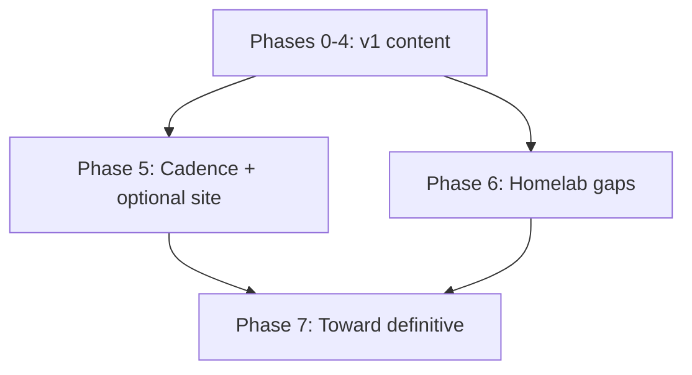

# Expand Plan

Created: 2026-07-29 · **Single canonical campaign doc** (merged 2026-08-01).  
Supersedes: former [ATTACK-PLAN.md](ATTACK-PLAN.md) pointer (draft weeks 0–11); there was never a checked-in `REFINE-PLAN.md`. Do not invent parallel plan files.

Operating rules: [AGENTS.md](AGENTS.md), [meta/conventions.md](meta/conventions.md), [meta/research-method.md](meta/research-method.md). Living checklist: [meta/todo-coverage.md](meta/todo-coverage.md).

## Snapshot (2026-08-01)

| Signal | State |
|--------|--------|
| Leaf articles | ~258 `status: complete` |
| Folder indexes | ~48 `status: index` |
| Intentional drafts | [self-healing-config-mesh.md](12-deployment-and-infra/self-healing-config-mesh.md); [meta/sources.md](meta/sources.md) |
| Relative `.md` links | 0 broken (audit in coverage; skip generated `docs/` if present) |
| Content campaign | Phases 0–4 + Phase 6 **done**; Phase 5.1 cadence **ongoing** |
| Site generator | deferred / experimental (optional Phase 5.2 / Batch D) |
| Active work | **Phase 7** — Batches A–C **done**; Batch D (site) gated |

**Verdict:** v1 wiki is stable (plain Markdown + MkDocs site). The tree *maps* the NixOS universe. Remaining work is freshness, depth on thin audiences, and navigation products—not inventing `16-*` domains.

---

## What “definitive” means

Not mirroring manuals or an exhaustive option encyclopedia (out of scope). It means: **every major journey in the NixOS universe has a trustworthy path through this vault**, stays current, and links outward to primary sources.

### Five expansion axes

| Axis | Goal | Prefer |
|------|------|--------|
| **1. Living truth** | Release/feature facts do not rot | [meta/release-checklist.md](meta/release-checklist.md); Phase 5.1 |
| **2. Gold depth** | High-pain leaves are runbook-grade | Thicken existing `complete` leaves |
| **3. Thin audiences** | Darwin, language ecosystems, cloud/org flakes, install variants | New leaves under `00`–`15` |
| **4. Navigation products** | Decision trees, FAQ, examples, roadmaps, link graph | Cheatsheets + `meta/examples/` + roadmaps |
| **5. Discoverability** | People can find the vault | Optional Phase 5.2 site generator |

### Intentionally out of scope

- Vendoring upstream manuals or the NixOS Wiki wholesale  
- Exhaustive option reference (link to `man configuration.nix` / [search.nixos.org](https://search.nixos.org/options))  
- Private org runbooks with secrets  
- Fashion tools without primary docs  
- New top-level domains until existing `00`–`15` cannot hold the topic  

### Priority rubric

Score candidates 1–5; do highest sum first:

1. **Audience pain** — beginners blocked, or operators losing machines  
2. **Uniqueness** — not a thin restatement of the manual  
3. **Link leverage** — unlocks many See also edges  
4. **Churn risk** — prefer stable topics before fashion tools  
5. **Source quality** — primary docs/code exist  

---

## Phase 7 — Toward definitive (active)

### Batch A — Cadence + first audience gaps (**done 2026-08-01**)

Institutionalize living truth, then close the highest-leverage audience holes.

| # | Path | Action |
|---|------|--------|
| A1 | [meta/release-checklist.md](meta/release-checklist.md) | **New** — operational checklist for Phase 5.1 triggers |
| A2 | [00-roadmap/reading-manuals-and-search.md](00-roadmap/reading-manuals-and-search.md) | **New** — how to use Nix/Nixpkgs/NixOS manuals + search.nixos.org |
| A3 | [13-implementations/frontends-and-ux/installers-and-nix-variants.md](13-implementations/frontends-and-ux/installers-and-nix-variants.md) | **New** — official Nix installer vs Lix vs Determinate (compare, don’t advertise) |
| A4 | [10-home-and-user/nix-darwin.md](10-home-and-user/nix-darwin.md) | **Deepen** — Apple Silicon, HM wiring, pin/branch pitfalls, common failures |
| A5 | [13-implementations/cloud-and-images/amazon-gce-azure.md](13-implementations/cloud-and-images/amazon-gce-azure.md) | **Deepen** — `build-image` variants, AMI discovery, GCE/Azure upload notes |

**Exit A:** met — all five landed `complete`/`active`; README Contents and roadmaps updated; sources rows added.

### Batch B — Language ecosystems + org flakes (**done 2026-08-01**)

| # | Path | Action |
|---|------|--------|
| B1 | [06-nixpkgs/packaging/haskell-packaging.md](06-nixpkgs/packaging/haskell-packaging.md) | **New** — `haskellPackages`, GHC versions, overlays |
| B2 | [06-nixpkgs/packaging/jvm-php-and-others.md](06-nixpkgs/packaging/jvm-php-and-others.md) | **New** — JVM / PHP / Ruby survey hub |
| B3 | [07-flakes/workflows/config-repo-layout.md](07-flakes/workflows/config-repo-layout.md) | **Deepen** — org-scale: private inputs, multi-host CI, teams |
| B4 | [11-development/private-flakes-and-ci.md](11-development/private-flakes-and-ci.md) | **New** — private inputs, access-tokens, CI matrices |

**Exit B:** met — all four `complete`; READMEs and contributor roadmap updated; sources rows added.

### Batch C — Gold thicken + getting help (**done 2026-08-01**)

| # | Path | Action |
|---|------|--------|
| C1 | [15-history-and-governance/getting-help-and-community.md](15-history-and-governance/getting-help-and-community.md) | **New** — Discourse/Matrix/RFCs norms |
| C2 | [09-nixos/architecture/module-system-internals.md](09-nixos/architecture/module-system-internals.md) | **Deepen** — Complete+ contributor density |
| C3 | [04-store-and-build/store-protocols.md](04-store-and-build/store-protocols.md) | **Deepen** — protocol choice + failure modes |
| C4 | [cheatsheets/faq-common-errors.md](cheatsheets/faq-common-errors.md) | **Deepen** — Batch A/B symptoms + wiki links |
| C5 | Roadmaps | beginner/operator/contributor → getting-help + FAQ |

**Exit C:** met — C1–C4 `complete`; roadmaps updated; coverage + sources updated.

### Batch D — Discoverability (gate)

Only after Batch A landed and cadence checklist is in use:

- Evaluate mdBook vs MkDocs vs plain static (Phase 5.2)  
- Nav = numbered domains (no IA rewrite)  
- Still **synthesize, don’t mirror**

---

## Phase 5 — Cadence and optional publishing (ongoing)

### 5.1 Maintenance cadence

Operational steps live in [meta/release-checklist.md](meta/release-checklist.md). Triggers:

| Trigger | Actions |
|---------|---------|
| Each NixOS release | Experimental tracking; release-cadence; installer/ops version cites |
| Each major Nix release | CLI cheatsheet; feature flags; store protocol notes |
| Quarterly | Clan/mesh/overlay-network; evaluator landscape; adjacent tools |
| As noticed | Renames/forks (Snix/Tvix/Lix); dead project warnings |

### 5.2 Site generator (gate)

Requires: Phase 0 done · complete-pass truthful · ≥1 Phase 3 slice drafted · Batch A cadence checklist in use · consensus on numbered-domain nav.

---

## Done history (do not reopen)

### Draft campaign (ATTACK weeks 0–11) — done 2026-07

Stub → draft across domains `00`–`15`, glossary, comparisons, cheatsheets. Checklist history: [meta/todo-coverage.md](meta/todo-coverage.md). Former plan file is a redirect only.

### Phase 0 — Meta truth — done 2026-07-30

Coverage reconciled; sources living draft; plan pointers; broken-link audit hook.

### Phase 1 — Refine / complete-pass — done 2026-07-30

Tiers A–D `complete`; Phase M.0 mesh cousin links. Optional quality deepen remains non-blocking.

### Phase 2 — Deepen existing — done 2026-07-30 / 2026-07-31

Ops/store/config/security deepen; gold calibration; consistency sweeps (terminology, CLI, version drift).

### Phase 3 — New areas — done 2026-07-30 / 2026-07-31

Hardware/boot, desktop, workloads, virt/edge, CI/platform, lang/eval depth, comparisons, security expansions — folded under `00`–`15` (no `16-*`). Skipped: hosted Garnix leaf (shut down 2026-07-15). Topic map retained for archaeology:

| Slice | Homes |
|-------|--------|
| 3.1 Hardware/boot | `09-nixos/configuration/` (impermanence, Lanzaboote, TPM, ZFS/btrfs, disko-recipes, firmware, nixos-hardware) |
| 3.2 Desktop | `09-nixos/desktop/` |
| 3.3 Workloads | `11-development/` (CUDA/ROCm, HPC, mobile, editor tooling) |
| 3.4 Virt/edge | libvirt, microvms, netboot, WSL, specialisations |
| 3.5 Platform | nix-copy/bundles, airgap, enterprise-identity; caches stay on binary-cache-hosting |
| 3.6 Lang/eval | IFD concept, eval perf, fetchers, LSP, module-system-internals, experimental-backlog |
| 3.7 Teaching | comparisons + FAQ |
| 3.8 Security | AppArmor/SELinux, ssh/age plugins, reproducible-builds-audit |

### Phase 4 — Cross-cutting products — done 2026-07-31

Glossary enrichment; roadmap refresh; `nix-conf-knobs`; FAQ; example corpus start.

### Phase 6 — Homelab / config-repo — done 2026-08-01

config-repo-layout, homelab-patterns, backups-and-restore, docker-and-podman, unfree-and-licenses, nix-ld-and-foreign-binaries.

### Phase M — Mesh / inter-trust — done 2026-07-30

machine-mesh, inter-machine-trust, clan-and-mesh, overlay-networks + cousin cross-links.

---

## Suggested execution (sessions)

| Batch | Work | Status |
|-------|------|--------|
| 0–7+ | Phases 0–4, M, 6, post-v1 gold | **done** |
| **A** | Cadence checklist + manuals + installers + darwin/cloud deepen | **done 2026-08-01** |
| **B** | Language ecosystems + org flakes | **done 2026-08-01** |
| **C** | Gold thicken + getting-help | **done 2026-08-01** |
| **D** | Optional site generator | gated |

Use **one subagent per leaf**; parent supplies research pack (3–8 facts, 1–3 URLs). After each batch: parent review, fix conflicts, update coverage + sources.

---

## Definition of done

| Stage | Meaning |
|-------|---------|
| **Article draft** | Accurate Overview + Details; ≥1 wiki link; ≥1 upstream Reference; `status: draft` |
| **Article complete** | Verified example (or version-noted); no uncited absolutes; coverage updated; `status: complete` |
| **Batch A done** | Five paths landed; README Contents; coverage + sources updated |
| **Phase 7 done** | Batches A–C met; cadence checklist used on ≥1 release refresh |

---

## Relationship to other files

| File | Role |
|------|------|
| **EXPAND-PLAN.md (this file)** | **Only** campaign plan — history + active Phase 7 |
| [ATTACK-PLAN.md](ATTACK-PLAN.md) | Redirect stub only (do not reopen campaign there) |
| [meta/todo-coverage.md](meta/todo-coverage.md) | Checklist ground truth |
| [meta/release-checklist.md](meta/release-checklist.md) | Operational Phase 5.1 steps (Batch A1) |
| `.cursor/plans/*` | Not authoritative if present |

Update **this** file when priorities shift. Do not create a third parallel campaign doc.
