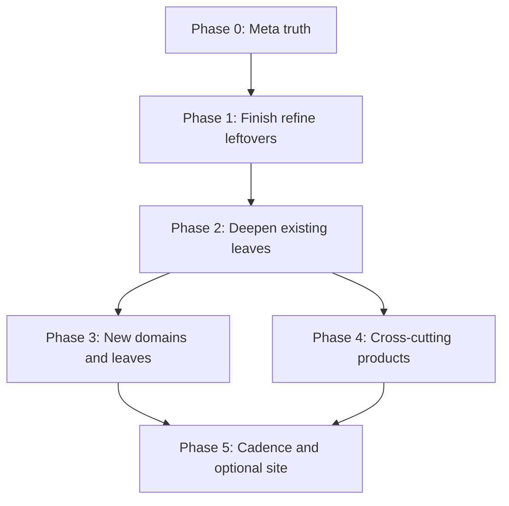

# Expand Plan

Created: 2026-07-29  
Supersedes: [ATTACK-PLAN.md](ATTACK-PLAN.md) (draft campaign done). There was never a checked-in `REFINE-PLAN.md`; this file is the current campaign doc (refine leftovers live in Phase 1 below).

Forward plan after the Phase 0–4 content campaign. Operating rules stay in [AGENTS.md](AGENTS.md), [meta/conventions.md](meta/conventions.md), and [meta/research-method.md](meta/research-method.md). Living checklist: [meta/todo-coverage.md](meta/todo-coverage.md).

## Snapshot (2026-07-31)

| Signal | State |
|--------|--------|
| Leaf articles | ~247 `status: complete` |
| Folder indexes | ~47 `status: index` |
| Stubs | none (draft campaign finished) |
| Intentional drafts | [self-healing-config-mesh.md](12-deployment-and-infra/self-healing-config-mesh.md) (design note); [meta/sources.md](meta/sources.md) (living URL table) |
| Relative `.md` links | 0 broken (audit hook in coverage) |
| Phase M + M.0 | done (mesh leaves + cousin cross-links) |
| Content campaign | Phases 0–4 done (Phase 3 slices A–C + desktop + §3.3–§3.8; Phase 4 products) |
| Living trackers | [meta/todo-coverage.md](meta/todo-coverage.md); [meta/sources.md](meta/sources.md) stays `draft` |
| Site generator | deferred (optional Phase 5.2) |

**Verdict:** Phase 0–4 content campaign complete; Phase 1 high-traffic quality deepen and Phase 2 gold/consistency polish landed 2026-07-31. Vault is stable for **v1** as Obsidian / plain Markdown. Remaining work is release cadence (Phase 5.1), optional further calibration, and optional site generator (Phase 5.2).

---

## Phase 0 — Meta truth (done 2026-07-30)

Goal: agents and humans stop chasing ghost TODOs.

1. **Reconcile [meta/todo-coverage.md](meta/todo-coverage.md)** — done: Complete-pass matches ~247 `complete` leaves; **Remaining work** lists only real gaps; M.0 later closed (2026-07-30).  
2. **Keep [meta/sources.md](meta/sources.md)** as `draft` living URL table (documented in-file).  
3. **Fix plan pointers** — root [README.md](README.md), [ATTACK-PLAN.md](ATTACK-PLAN.md), [AGENTS.md](AGENTS.md), [meta/quality-checklist.md](meta/quality-checklist.md) cite this file; ghost `REFINE-PLAN.md` link removed from this header.  
4. **Audit hook** — status histogram + broken-relative-link Node snippet in coverage.

**Exit:** coverage file matches the tree; one obvious “next work” doc at root. *(Met 2026-07-30; snapshot restamped 2026-07-31 for v1.)*

---

## Phase 1 — Close the refine backlog (existing leaves)

Status promotion / Complete-pass checkoff + M.0: **done**. Remaining Phase 1 work is optional **quality deepen** (examples, version stamps, See also) — non-blocking for v1. Prefer verify-and-checkoff over rewrite when already `complete`.

### 1.1 Complete-pass audit (tiers A–D)

Walk [meta/quality-checklist.md](meta/quality-checklist.md) on any leaf still soft on:

- Verified minimal example (or explicit “cannot run offline” note)  
- Version stamps on experimental / unstable CLI  
- `## See also` mesh for cousins  
- Absolute claims cited  

Priority order (traffic / dependency):

| Priority | Cluster | Why |
|----------|---------|-----|
| A | Roadmaps + glossary + cheatsheets | Entry points; must match leaf reality |
| B | Operator: `nix.conf`, trusted users/substituters, store protocols, remote builders, upgrades, troubleshooting | Day-2 ops |
| C | Contributor: idioms leftovers, flake workflows, `11-development/*` | People packaging and testing |
| D | Experimental feature pages + deploy/security periphery | High churn; stamp versions |

### 1.2 Phase M.0 cross-link pass (done 2026-07-30)

Cousin links landed for the six trust axes:

- Fleet: colmena, deploy-rs, morph-nixinate, remote-deploy ↔ [clan-and-mesh](12-deployment-and-infra/clan-and-mesh.md)  
- Build/store: remote-builders, caches, narinfo, protocols ↔ [inter-machine-trust](14-security-and-trust/inter-machine-trust.md)  
- Secrets: secrets-management, agenix-sops-nix, secrets-strategies  
- Glossary hooks for mesh vs Digga/Hive “hive” naming  

**Exit:** coverage Complete-pass + M.0 rows truthful; no broken cousin links in the mesh neighborhood. *(Met 2026-07-30.)*

---

## Phase 2 — Deepen existing knowledge (no new domains yet)

Core deepen sessions (ops/store/config/security): **done 2026-07-30**. Remaining table rows are optional thicken — non-blocking for v1. One subagent per leaf; parent supplies research packs.

### 2.1 Depth targets (existing files)

| Area | Leaves to thicken | Angle |
|------|-------------------|--------|
| Store | `store-protocols`, `substitutes-and-narinfo`, `remote-builders`, `debugging-builds` | Protocols, NAR/narinfo fields, SSH builders, common failure modes |
| NixOS ops | `troubleshooting`, `upgrades`, `activation-script`, `systemd-integration` | Decision trees; channel vs flake upgrade; activation vs systemd unit failures |
| Config | `networking`, `partitioning-and-bootloaders`, `secrets-strategies` | nftables/NetworkManager patterns; EFI/UKI pointers; secrets pattern matrix |
| Language | `anti-patterns`, `callPackage`, `overlays-pattern` | Concrete bad→good snippets |
| Flakes | `pure-eval-and-impure`, `checks-and-hydraJobs`, `packages-apps-devShells` | IFD, `self`/`inputs`, CI flake checks |
| Dev | `ci-with-nix`, `testing-nixos-vm-tests`, `language-toolchains` | GitHub Actions / Forgejo / Hydra recipes; `testers.*`; split language stubs if one leaf is overcrowded |
| Security | `supply-chain`, `sandbox-escape-surface`, `signing-and-caches` | Threat model tables; what FODs do and do not buy |
| Implementations | evaluator quartet + frameworks | Maturity / last-checked date; avoid stale rename lore |

### 2.2 Consistency sweeps (tree-wide, read-mostly)

Run as batches, not endless polish:

1. **Terminology** — flake vs channel wording; CppNix / Lix / Nix naming; hive vs mesh.  
2. **CLI surface** — classic vs modern command pairs agree with [cheatsheets/cli.md](cheatsheets/cli.md).  
3. **Version drift** — experimental features vs current stable Nix shipped on latest NixOS release.  
4. **Orphan / hub links** — every domain README Contents entry resolves; high-traffic pages have 2–6 useful See also links.  
5. **Example hygiene** — no secrets; snippets 5–20 lines; prefer invented minimal examples over pasted real hosts.

### 2.3 Gold-page calibration

Pick 3–5 gold standards (already good: e.g. `01-philosophy/why-nix.md`, core concepts, `flake-nix-schema`) and rewrite the worst outliers in each domain toward that density and tone—not longer for its own sake.

**Exit:** operator and contributor paths feel “runbook-grade”; experimental pages version-stamped for the current release pair.

---

## Phase 3 — New areas (structure not in the original map)

**Done** for the chosen slices (A–C, desktop §3.2, §3.3–§3.8) as of 2026-07-30 / 2026-07-31 — see [meta/todo-coverage.md](meta/todo-coverage.md). Sections below stay as the historical topic map. Further leaves only when a research pack exists and a home domain is agreed. Prefer **new leaves under existing `00`–`15`** before inventing `16-*`.

### 3.1 Proposed new domain: `16-hardware-boot-and-storage` (optional number)

Topics the tree barely touches today:

| Leaf (suggested) | Scope |
|------------------|--------|
| `secure-boot-and-lanzaboote.md` | UEFI Secure Boot, Lanzaboote, ukify |
| `tpm-and-measured-boot.md` | TPM PCR, clevis-like patterns, secrets at unlock |
| `impermanence.md` | tmpfs/root wipe, what to persist, with Home Manager |
| `zfs-and-btrfs.md` | Declarative datasets/subvols, scrub, native encryption notes |
| `disko-recipes.md` | Cross-link [disko](12-deployment-and-infra/disko.md); common layouts (ext4, btrfs, zfs, LUKS) |
| `firmware-and-microcode.md` | `hardware.enableRedistributableFirmware`, CPU microcode |
| `nixos-hardware.md` | Using [nixos-hardware](https://github.com/NixOS/nixos-hardware) profiles |

*Alternative:* fold these under `09-nixos/configuration/` and `09-nixos/installation/` if you want to avoid a 16th domain.

### 3.2 Proposed new domain: `17-desktop-and-apps` (or under `09` / `10`)

| Leaf | Scope |
|------|--------|
| `wayland-and-compositors.md` | Plasma, GNOME, Hyprland/Sway patterns; portals |
| `audio-pipewire.md` | PipeWire vs Pulse leftovers |
| `fonts-and-locales.md` | Fontconfig, i18n |
| `flatpak-and-fhs.md` | Flatpak coexistence; `buildFHSEnv` / steam-run |
| `gaming-steam-proton.md` | Steam, Proton, Gamescope (high demand; keep factual) |
| `printing-and-scanning.md` | CUPS, SANE |

### 3.3 Workloads and specialized stacks (likely under `11-development` + `06-nixpkgs`)

| Leaf | Scope |
|------|--------|
| `cuda-rocm-ml.md` | CUDA/ROCm packaging gotchas; binary caches |
| `scientific-and-hpc.md` | Modules, MPI, site overlays |
| `android-and-mobile.md` | Robotnix / NixOS Mobile survey (maturity-stamped) |
| `emacs-neovim-tooling.md` | Common flake/HM patterns (patterns only) |

### 3.4 Virtualization, images, and edge (extend `09` / `13`)

| Leaf | Scope |
|------|--------|
| `libvirt-and-vms.md` | Declarative libvirt; vs `nixos-rebuild build-vm` |
| `microvms.md` | MicroVM.nix / similar |
| `netboot-and-pxe.md` | netboot.xyz, NixOS netboot |
| `specialisations.md` | NixOS specialisations |
| `wsl-and-foreign-os.md` | Nix on WSL2; deepen beyond [nix-on-other-distros](10-home-and-user/nix-on-other-distros.md) |

### 3.5 CI, caches, and “Nix as platform” (extend `11` / `12`)

| Leaf | Scope |
|------|--------|
| `garnix-and-hosted-ci.md` | Garnix, FlakeHub, similar (compare, don’t advertise) |
| `attic-harmonia-cachix.md` | Split from [binary-cache-hosting](12-deployment-and-infra/binary-cache-hosting.md) if overcrowded |
| `nix-copy-and-bundles.md` | `nix copy`, `nix bundle`, closure shipping |
| `airgap-and-offline.md` | Offline install/update; USB substituters |
| `enterprise-identity.md` | LDAP/AD/SSSD patterns on NixOS |

### 3.6 Language / evaluator depth (extend `03` / `04` / `08`)

| Leaf | Scope |
|------|--------|
| `import-from-derivation.md` | IFD costs, when allowed, flake pure-eval interaction |
| `lazy-trees-and-eval-perf.md` | Eval performance, memory, large monorepos |
| `fetchers-and-pinning.md` | `fetchurl` family, npins vs flakes (migration cousin) |
| `lsp-and-ide.md` | nil, nixd, formatter integration |
| `module-system-internals.md` | Deep dive beyond [module-system](09-nixos/architecture/module-system.md): freeform, `evalModules`, types |
| `experimental-backlog.md` | Features not yet leaf’d; keep [tracking-stabilization](08-experimental-features/tracking-stabilization.md) as hub |

### 3.7 Comparisons and teaching (extend cross-cutting)

| Leaf | Scope |
|------|--------|
| `nix-vs-bazel-buck.md` | Hermetic build systems |
| `nix-vs-ansible-terraform.md` | Config management / IaC roles (pair with existing terraform leaf) |
| `nix-vs-containers-orchestrators.md` | K8s/Nomad coexistence; Kubenix survey |
| `ubuntu-arch-to-nixos.md` | Migration playbook (operator path) |
| `faq-common-errors.md` | Symptom → likely cause → wiki link (new `cheatsheets/` or `00-roadmap/`) |

### 3.8 Security expansions (extend `14`)

| Leaf | Scope |
|------|--------|
| `apparmor-selinux.md` | MAC frameworks on NixOS |
| `ssh-and-age-plugins.md` | Host keys, age plugins, YubiKey patterns |
| `reproducible-builds-audit.md` | `diffoscope`, rebuild-scripts, what “reproducible” means in nixpkgs |

### 3.9 Intentionally out of scope (until asked)

- Vendoring upstream manuals or the NixOS Wiki wholesale  
- MkDocs/mdBook/Hugo **before** Phases 0–2 are healthy (see Phase 5)  
- Exhaustive option reference (link to `man configuration.nix` / search.nixos.org instead)  
- Private org runbooks with secrets  

**Exit for Phase 3:** stub → draft for the chosen slice (recommend **hardware/boot** + **troubleshooting FAQ** + **IFD/perf** first); domain READMEs updated; sources rows added. *(Exit met for slices A–C + desktop + §3.3–§3.8.)*

---

## Phase 4 — Cross-cutting products (done 2026-07-31)

Improvements that are not “one more leaf,” but raise the whole base. Landed: glossary enrichment, roadmap refresh, `nix-conf-knobs` cheatsheet (FAQ/troubleshooting leaf shipped under Phase 3 slice B).

| Product | Purpose |
|---------|---------|
| **Glossary enrichment** | Mesh/hive, IFD, FOD, CA, specialisation, impermanence, Lanzaboote |
| **Roadmap refresh** | Beginner / operator / contributor paths include new leaves; keep honest length |
| **Cheatsheet: troubleshooting** | Dense symptom table pointing into domains |
| **Cheatsheet: nix.conf knobs** | High-signal settings only |
| **Concept additions** in `02-concepts/` | e.g. `import-from-derivation.md`, `specialisation.md`, `impermanence.md` (concept) vs deep dives elsewhere |
| **Example corpus** (optional `meta/examples/` or inline only) | Tiny flakes used by multiple articles; no secrets; not a second wiki |
| **Link graph hygiene** | Periodic broken-link + orphan report; record date in coverage |

---

## Phase 5 — Cadence and optional publishing

Post-v1 track. Content campaign does not block on this phase.

### 5.1 Maintenance cadence

| Trigger | Actions |
|---------|---------|
| Each NixOS release | Refresh experimental tracking; release-cadence; installer/ops leaves that cite versions |
| Each major Nix release | CLI cheatsheet; feature flags; store protocol notes |
| Quarterly | Clan/mesh/overlay-network; evaluator landscape; adjacent tools under `05-cli-and-tooling/adjacent-tools/` |
| As noticed | Renames/forks (Snix/Tvix/Lix); dead project warnings on framework leaves |

### 5.2 Site generator (gate)

Only after:

- Phase 0 done  
- Phase 1 complete-pass lists truthful  
- At least one Phase 3 slice drafted  
- Consensus on nav = numbered domains (no IA rewrite)

Then evaluate mdBook vs MkDocs vs plain static; still **synthesize, don’t mirror**.

---

## Suggested execution order (sessions)

| Session batch | Work | Status |
|---------------|------|--------|
| **0** | Phase 0 meta reconcile + pointer fixes | **done 2026-07-30** |
| **1** | Phase 1.2 mesh cross-links + glossary hooks | **done 2026-07-30** |
| **2** | Phase 2 deepen: troubleshooting + upgrades + store protocols | **done 2026-07-30** |
| **3** | Phase 2 deepen: networking + secrets matrix + supply-chain | **done 2026-07-30** |
| **4** | Phase 3 slice A: hardware/boot/impermanence | **done 2026-07-30** |
| **5** | Phase 3 slice B: FAQ/common-errors + IFD + eval perf | **done 2026-07-30** |
| **6** | Phase 3 slice C + desktop | **done 2026-07-30** |
| **7+** | Phase 3 §3.3–§3.8; Phase 4 products | **done 2026-07-31** |
| **post-v1** | Optional Phase 1 quality deepen; cadence (5.1); optional site generator (5.2) | open / non-blocking |

Use **one subagent per new or deepened leaf**; parent supplies research pack (3–8 facts, 1–3 URLs). After each batch: parent review, fix conflicts, update coverage + sources.

---

## Priority rubric (when choosing what to write)

Score candidates 1–5 on each; do highest sum first:

1. **Audience pain** — beginners blocked, or operators losing machines  
2. **Uniqueness** — not a thin restatement of the manual  
3. **Link leverage** — unlocks many See also edges  
4. **Churn risk** — prefer stable topics before fashion tools  
5. **Source quality** — primary docs/code exist; avoid Discord-only topics  

---

## Definition of done

| Stage | Meaning |
|-------|---------|
| **Phase 0 done** | Coverage matches tree; this plan linked from README/AGENTS — **met** |
| **Phase 1 done** | No false-open complete-pass rows; M.0 cross-links present — **met** (quality deepen remains optional) |
| **Phase 2 done** | Operator/contributor gold path leaves have verified examples and cousin links — **core sessions met**; further thicken optional |
| **Phase 3 slice done** | New leaves at least `draft` with References; README Contents updated — **slices A–C + desktop + §3.3–§3.8 met** |
| **Phase 4 done** | Glossary / roadmaps / high-signal cheatsheets landed — **met 2026-07-31** |
| **Article draft / complete** | Unchanged from [AGENTS.md](AGENTS.md) / [meta/todo-coverage.md](meta/todo-coverage.md) |

---

## Relationship to other plan files

| File | Role |
|------|------|
| [ATTACK-PLAN.md](ATTACK-PLAN.md) | Historical draft campaign pointer (weeks 0–11) — do not reopen |
| **EXPAND-PLAN.md (this file)** | Content campaign (Phases 0–4) + post-v1 cadence / optional deepen |
| [meta/todo-coverage.md](meta/todo-coverage.md) | Checklist ground truth (must be kept aligned) |
| `.cursor/plans/*` | Optional IDE plan copies; not authoritative for the repo |

Do not invent a third parallel campaign. Update **this** file when priorities shift.
