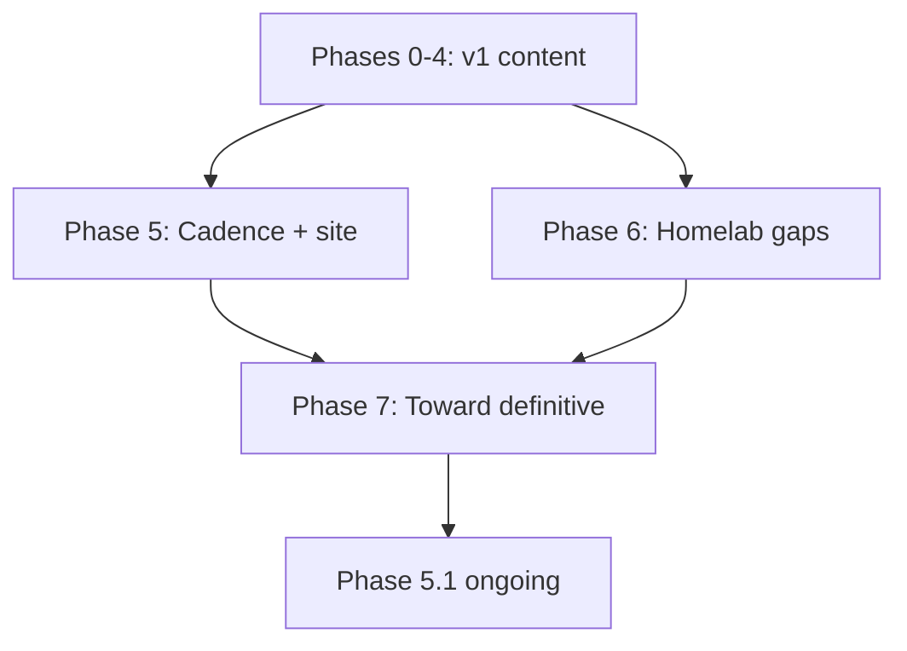

# Expand Plan

Created: 2026-07-29 · **Single canonical campaign doc** (merged 2026-08-01).  
Supersedes: former [ATTACK-PLAN.md](ATTACK-PLAN.md) pointer (draft weeks 0–11); there was never a checked-in `REFINE-PLAN.md`. Do not invent parallel plan files.

Operating rules: [AGENTS.md](AGENTS.md), [meta/conventions.md](meta/conventions.md), [meta/research-method.md](meta/research-method.md). Living checklist: [meta/todo-coverage.md](meta/todo-coverage.md).

## Snapshot (2026-08-01 — Phase 7 closed)

| Signal | State |
|--------|--------|
| Leaf articles | ~274 `status: complete` |
| Folder indexes | ~49 `status: index` |
| Intentional drafts | [self-healing-config-mesh.md](12-deployment-and-infra/self-healing-config-mesh.md); [meta/sources.md](meta/sources.md) |
| Relative `.md` links | 0 broken (audit in coverage; skip generated `docs/` if present) |
| Content campaign | Phases 0–4, 6, **7 done**; Phase 5.1 cadence **ongoing** |
| Site generator | **live** — MkDocs Material → [zemdregon.github.io/nix-docs](https://zemdregon.github.io/nix-docs/) ([meta/site.md](meta/site.md)) |
| Active work | **Phase 5.1 cadence only** — [meta/release-checklist.md](meta/release-checklist.md) |

**Verdict:** Campaign content batches are closed. The tree maps the NixOS universe with choosers, worked configs, and gold deepenings. Remaining work is **living truth** (release/quarterly refresh), optional gold thicken on thin audiences, and keeping intentional drafts intentional—not inventing new top-level domains.

---

## What “definitive” means

Not mirroring manuals or an exhaustive option encyclopedia (out of scope). It means: **every major journey in the NixOS universe has a trustworthy path through this vault**, stays current, and links outward to primary sources.

### Five expansion axes

| Axis | Goal | Prefer |
|------|------|--------|
| **1. Living truth** | Release/feature facts do not rot | [meta/release-checklist.md](meta/release-checklist.md); Phase 5.1 |
| **2. Gold depth** | High-pain leaves are runbook-grade | Thicken existing `complete` leaves |
| **3. Thin audiences** | Darwin, language ecosystems, cloud/org flakes, install variants | New leaves under `00`–`15` |
| **4. Navigation products** | Decision trees, FAQ, examples, roadmaps, link graph | Cheatsheets + `meta/examples/` + roadmaps |
| **5. Discoverability** | People can find the vault | Optional Phase 5.2 site generator |

### Intentionally out of scope

- Vendoring upstream manuals or the NixOS Wiki wholesale  
- Exhaustive option reference (link to `man configuration.nix` / [search.nixos.org](https://search.nixos.org/options))  
- Private org runbooks with secrets  
- Fashion tools without primary docs  
- New top-level domains until existing `00`–`15` cannot hold the topic  

### Priority rubric

Score candidates 1–5; do highest sum first:

1. **Audience pain** — beginners blocked, or operators losing machines  
2. **Uniqueness** — not a thin restatement of the manual  
3. **Link leverage** — unlocks many See also edges  
4. **Churn risk** — prefer stable topics before fashion tools  
5. **Source quality** — primary docs/code exist  

---

## Phase 7 — Toward definitive (**done 2026-08-01**)

### Batch A — Cadence + first audience gaps (**done 2026-08-01**)

Institutionalize living truth, then close the highest-leverage audience holes.

| # | Path | Action |
|---|------|--------|
| A1 | [meta/release-checklist.md](meta/release-checklist.md) | **New** — operational checklist for Phase 5.1 triggers |
| A2 | [00-roadmap/reading-manuals-and-search.md](00-roadmap/reading-manuals-and-search.md) | **New** — how to use Nix/Nixpkgs/NixOS manuals + search.nixos.org |
| A3 | [13-implementations/frontends-and-ux/installers-and-nix-variants.md](13-implementations/frontends-and-ux/installers-and-nix-variants.md) | **New** — official Nix installer vs Lix vs Determinate (compare, don’t advertise) |
| A4 | [10-home-and-user/nix-darwin.md](10-home-and-user/nix-darwin.md) | **Deepen** — Apple Silicon, HM wiring, pin/branch pitfalls, common failures |
| A5 | [13-implementations/cloud-and-images/amazon-gce-azure.md](13-implementations/cloud-and-images/amazon-gce-azure.md) | **Deepen** — `build-image` variants, AMI discovery, GCE/Azure upload notes |

**Exit A:** met — all five landed `complete`/`active`; README Contents and roadmaps updated; sources rows added.

### Batch B — Language ecosystems + org flakes (**done 2026-08-01**)

| # | Path | Action |
|---|------|--------|
| B1 | [06-nixpkgs/packaging/haskell-packaging.md](06-nixpkgs/packaging/haskell-packaging.md) | **New** — `haskellPackages`, GHC versions, overlays |
| B2 | [06-nixpkgs/packaging/jvm-php-and-others.md](06-nixpkgs/packaging/jvm-php-and-others.md) | **New** — JVM / PHP / Ruby survey hub |
| B3 | [07-flakes/workflows/config-repo-layout.md](07-flakes/workflows/config-repo-layout.md) | **Deepen** — org-scale: private inputs, multi-host CI, teams |
| B4 | [11-development/private-flakes-and-ci.md](11-development/private-flakes-and-ci.md) | **New** — private inputs, access-tokens, CI matrices |

**Exit B:** met — all four `complete`; READMEs and contributor roadmap updated; sources rows added.

### Batch C — Gold thicken + getting help (**done 2026-08-01**)

| # | Path | Action |
|---|------|--------|
| C1 | [15-history-and-governance/getting-help-and-community.md](15-history-and-governance/getting-help-and-community.md) | **New** — Discourse/Matrix/RFCs norms |
| C2 | [09-nixos/architecture/module-system-internals.md](09-nixos/architecture/module-system-internals.md) | **Deepen** — Complete+ contributor density |
| C3 | [04-store-and-build/store-protocols.md](04-store-and-build/store-protocols.md) | **Deepen** — protocol choice + failure modes |
| C4 | [cheatsheets/faq-common-errors.md](cheatsheets/faq-common-errors.md) | **Deepen** — Batch A/B symptoms + wiki links |
| C5 | Roadmaps | beginner/operator/contributor → getting-help + FAQ |

**Exit C:** met — C1–C4 `complete`; roadmaps updated; coverage + sources updated.

### Batch D — Discoverability / site (**done 2026-08-01**)

MkDocs Material + GitHub Actions Pages. Live: [https://zemdregon.github.io/nix-docs/](https://zemdregon.github.io/nix-docs/). Ops notes: [meta/site.md](meta/site.md). Nav = numbered domain indexes (no IA rewrite). Still synthesize, don’t mirror.

**Exit D:** met — workflow green on `main`; `site_url` / repo URLs point at `zemdregon/nix-docs`.

### Batch E — Post-publish polish (**done 2026-08-01**)

Close the thin spots that public readers hit first after the site went live.

| # | Path | Action |
|---|------|--------|
| E1 | [glossary.md](glossary.md) | Enrich Phase 7 terms |
| E2 | [11-development/language-toolchains.md](11-development/language-toolchains.md) | Deepen — Haskell/JVM/PHP + failure modes |
| E3 | [06-nixpkgs/architecture/package-sets.md](06-nixpkgs/architecture/package-sets.md) | Deepen — by-name, scopes, decision table |
| E4 | [README.md](README.md) + roadmaps | Homepage clarity for web |

**Exit E:** met — glossary/toolchains/package-sets deepened; README + roadmap index refreshed.

### Batch F — Configuration examples domain (**done 2026-08-01**)

New top-level [16-configuration-examples](16-configuration-examples/README.md) — multi-file walkthroughs composing `00`–`15` (distinct from [meta/examples](meta/examples/README.md)). Nav wired in root README, roadmaps, `mkdocs.yml`, `prepare-docs-dir.sh`.

**Exit F:** met — seven worked-config leaves + domain index.

### Batch G — CI / Hydra / cross / builders cheatsheet (**done 2026-08-01**)

| # | Path | Action |
|---|------|--------|
| G1 | [12-deployment-and-infra/hydra.md](12-deployment-and-infra/hydra.md) | **Deepen** — jobsets, flakes, when not Hydra |
| G2 | [11-development/ci-with-nix.md](11-development/ci-with-nix.md) | **Deepen** — matrices, caches, failure modes |
| G3 | [06-nixpkgs/packaging/cross-compilation.md](06-nixpkgs/packaging/cross-compilation.md) | **Deepen** — pkgsCross chooser + failure modes |
| G4 | [cheatsheets/packaging-builders.md](cheatsheets/packaging-builders.md) | **New** — language-builder → leaf table |

**Exit G:** met — G1–G4 `complete`; cheatsheets README updated.

### Batch H — Install bootstrap + secrets tools + VM tests (**done 2026-08-01**)

| # | Path | Action |
|---|------|--------|
| H1 | [cheatsheets/install-and-bootstrap.md](cheatsheets/install-and-bootstrap.md) | **New** — chooser: ISO / anywhere / disko-install / netboot / HM-only / darwin / WSL |
| H2 | [09-nixos/installation/nixos-anywhere.md](09-nixos/installation/nixos-anywhere.md) | **Deepen** — failure modes, when not to use, aarch64/`--kexec` |
| H3 | [12-deployment-and-infra/agenix-sops-nix.md](12-deployment-and-infra/agenix-sops-nix.md) | **Deepen** — chooser + rekey / identity failure modes |
| H4 | [11-development/testing-nixos-vm-tests.md](11-development/testing-nixos-vm-tests.md) | **Deepen** — flake `checks`, CI, interactive debug failures |

**Exit H:** met — H1–H4 `complete`; cheatsheets README + beginner/operator roadmaps updated; sources row for custom kexec.

### Batch I — Fleet deploy navigation (**done 2026-08-01**)

| # | Path | Action |
|---|------|--------|
| I1 | [cheatsheets/fleet-deploy.md](cheatsheets/fleet-deploy.md) | **New** — `nixos-rebuild --target-host` vs Colmena vs deploy-rs vs Morph/Nixinate vs Clan |
| I2 | [12-deployment-and-infra/deploy-rs.md](12-deployment-and-infra/deploy-rs.md) | **Deepen** — chooser edges + failure modes (magic-rollback, SSH users) |
| I3 | [12-deployment-and-infra/morph-nixinate.md](12-deployment-and-infra/morph-nixinate.md) | **Deepen** — maturity stamp + when still fit |
| I4 | [09-nixos/operations/remote-deploy.md](09-nixos/operations/remote-deploy.md) | **Deepen** — failure modes; link fleet chooser |

**Exit I:** met — I1–I4 `complete`; cheatsheets + operator roadmap updated.

### Batch J — Disk layout + impermanence (**done 2026-08-01**)

| # | Path | Action |
|---|------|--------|
| J1 | [cheatsheets/disk-and-persistence.md](cheatsheets/disk-and-persistence.md) | **New** — disko vs manual vs recipes vs impermanence chooser |
| J2 | [12-deployment-and-infra/disko.md](12-deployment-and-infra/disko.md) | **Deepen** — modes, by-id, failure modes |
| J3 | [09-nixos/configuration/impermanence.md](09-nixos/configuration/impermanence.md) | **Deepen** — neededForBoot, secrets, failure modes |
| J4 | [09-nixos/configuration/disko-recipes.md](09-nixos/configuration/disko-recipes.md) | **Deepen** — template refresh + when-not |

**Exit J:** met — J1–J4 `complete`; operator + install-bootstrap wired.

### Batch K — Binary cache navigation (**done 2026-08-01**)

| # | Path | Action |
|---|------|--------|
| K1 | [cheatsheets/binary-caches.md](cheatsheets/binary-caches.md) | **New** — public / private / nix-serve / Harmonia / Attic / Cachix / S3 |
| K2 | [12-deployment-and-infra/binary-cache-hosting.md](12-deployment-and-infra/binary-cache-hosting.md) | **Deepen** — chooser + failure modes |
| K3 | [04-store-and-build/binary-caches.md](04-store-and-build/binary-caches.md) | **Deepen** — client failure modes (trust, fallback, priority) |
| K4 | [14-security-and-trust/signing-and-caches.md](14-security-and-trust/signing-and-caches.md) | **Deepen** — key/trust failure modes |

**Exit K:** met — K1–K4 `complete`; CI + operator wired.

### Batch L — Configuration examples expand (**done 2026-08-01**)

Second wave under [16-configuration-examples](16-configuration-examples/README.md) — compose Batches G–J deepenings into worked configs.

| # | Path | Action |
|---|------|--------|
| L1 | [16-configuration-examples/disko-impermanence-host.md](16-configuration-examples/disko-impermanence-host.md) | **New** — disko + tmpfs root + `/persist` |
| L2 | [16-configuration-examples/nixos-anywhere-bootstrap.md](16-configuration-examples/nixos-anywhere-bootstrap.md) | **New** — remote SSH wipe-and-install |
| L3 | [16-configuration-examples/deploy-rs-fleet.md](16-configuration-examples/deploy-rs-fleet.md) | **New** — day-2 multi-profile hub deploy |
| L4 | [16-configuration-examples/flake-ci-github-actions.md](16-configuration-examples/flake-ci-github-actions.md) | **New** — GHA install/cache/`flake check`/host matrix |

**Exit L:** met — L1–L4 `complete`; domain README + roadmaps + chooser See also inbound; closeout verify pass 2026-08-01 (`broken=0`).

### Phase 7 exit

**Met 2026-08-01:** Batches A–L landed; site live (Batch D); cadence checklist exists and was used on a prior refresh (2026-07-31). No further Phase 7 batches. Post-campaign work = Phase 5.1 only (plus optional gold thicken scored by the priority rubric).

---

## Phase 5 — Cadence and optional publishing (ongoing)

### 5.1 Maintenance cadence

Operational steps live in [meta/release-checklist.md](meta/release-checklist.md). Triggers:

| Trigger | Actions |
|---------|---------|
| Each NixOS release | Experimental tracking; release-cadence; installer/ops version cites |
| Each major Nix release | CLI cheatsheet; feature flags; store protocol notes |
| Quarterly | Clan/mesh/overlay-network; evaluator landscape; adjacent tools |
| As noticed | Renames/forks (Snix/Tvix/Lix); dead project warnings |

### 5.2 Site generator (**done 2026-08-01**)

Shipped as MkDocs Material + [`.github/workflows/pages.yml`](.github/workflows/pages.yml). See [meta/site.md](meta/site.md) and Batch D above.

---

## Done history (do not reopen)

### Draft campaign (ATTACK weeks 0–11) — done 2026-07

Stub → draft across domains `00`–`15`, glossary, comparisons, cheatsheets. Checklist history: [meta/todo-coverage.md](meta/todo-coverage.md). Former plan file is a redirect only.

### Phase 0 — Meta truth — done 2026-07-30

Coverage reconciled; sources living draft; plan pointers; broken-link audit hook.

### Phase 1 — Refine / complete-pass — done 2026-07-30

Tiers A–D `complete`; Phase M.0 mesh cousin links. Optional quality deepen remains non-blocking.

### Phase 2 — Deepen existing — done 2026-07-30 / 2026-07-31

Ops/store/config/security deepen; gold calibration; consistency sweeps (terminology, CLI, version drift).

### Phase 3 — New areas — done 2026-07-30 / 2026-07-31

Hardware/boot, desktop, workloads, virt/edge, CI/platform, lang/eval depth, comparisons, security expansions — folded under `00`–`15` (no `16-*`). Skipped: hosted Garnix leaf (shut down 2026-07-15). Topic map retained for archaeology:

| Slice | Homes |
|-------|--------|
| 3.1 Hardware/boot | `09-nixos/configuration/` (impermanence, Lanzaboote, TPM, ZFS/btrfs, disko-recipes, firmware, nixos-hardware) |
| 3.2 Desktop | `09-nixos/desktop/` |
| 3.3 Workloads | `11-development/` (CUDA/ROCm, HPC, mobile, editor tooling) |
| 3.4 Virt/edge | libvirt, microvms, netboot, WSL, specialisations |
| 3.5 Platform | nix-copy/bundles, airgap, enterprise-identity; caches stay on binary-cache-hosting |
| 3.6 Lang/eval | IFD concept, eval perf, fetchers, LSP, module-system-internals, experimental-backlog |
| 3.7 Teaching | comparisons + FAQ |
| 3.8 Security | AppArmor/SELinux, ssh/age plugins, reproducible-builds-audit |

### Phase 4 — Cross-cutting products — done 2026-07-31

Glossary enrichment; roadmap refresh; `nix-conf-knobs`; FAQ; example corpus start.

### Phase 6 — Homelab / config-repo — done 2026-08-01

config-repo-layout, homelab-patterns, backups-and-restore, docker-and-podman, unfree-and-licenses, nix-ld-and-foreign-binaries.

### Phase M — Mesh / inter-trust — done 2026-07-30

machine-mesh, inter-machine-trust, clan-and-mesh, overlay-networks + cousin cross-links.

---

## Suggested execution (sessions)

| Batch | Work | Status |
|-------|------|--------|
| 0–7+ | Phases 0–4, M, 6, post-v1 gold | **done** |
| **A** | Cadence checklist + manuals + installers + darwin/cloud deepen | **done 2026-08-01** |
| **B** | Language ecosystems + org flakes | **done 2026-08-01** |
| **C** | Gold thicken + getting-help | **done 2026-08-01** |
| **D** | MkDocs + GitHub Pages (`zemdregon.github.io/nix-docs`) | **done 2026-08-01** |
| **E** | Post-publish: glossary + toolchains + package-sets + homepage | **done 2026-08-01** |
| **F** | `16-configuration-examples` worked-config domain | **done 2026-08-01** |
| **G** | Hydra / CI / cross / packaging-builders cheatsheet | **done 2026-08-01** |
| **H** | Install bootstrap chooser + anywhere / agenix-sops / VM tests | **done 2026-08-01** |
| **I** | Fleet deploy chooser + deploy-rs / morph / remote-deploy | **done 2026-08-01** |
| **J** | Disk/persistence chooser + disko / impermanence / recipes | **done 2026-08-01** |
| **K** | Binary-cache chooser + hosting / client / signing | **done 2026-08-01** |
| **L** | Worked configs: disko/impermanence, anywhere, deploy-rs, GHA CI | **done 2026-08-01** |
| **Closeout** | Subagent verify on new G–L leaves; plan + coverage sync; audits | **done 2026-08-01** |

Campaign batch table is **closed**. Further sessions: Phase 5.1 cadence, or optional gold thicken (score with the priority rubric)—do not reopen A–L unless a factual bug is found.

Use **one subagent per leaf** for any new deepen/new leaf; parent supplies research pack (3–8 facts, 1–3 URLs). After each batch: parent review, fix conflicts, update coverage + sources.

---

## Definition of done

| Stage | Meaning |
|-------|---------|
| **Article draft** | Accurate Overview + Details; ≥1 wiki link; ≥1 upstream Reference; `status: draft` |
| **Article complete** | Verified example (or version-noted); no uncited absolutes; coverage updated; `status: complete` |
| **Batch A done** | Five paths landed; README Contents; coverage + sources updated |
| **Phase 7 done** | Batches A–L met; site live; cadence checklist used on ≥1 refresh — **met 2026-08-01** |

---

## Relationship to other files

| File | Role |
|------|------|
| **EXPAND-PLAN.md (this file)** | **Only** campaign plan — history; Phase 7 closed; Phase 5.1 cadence |
| [ATTACK-PLAN.md](ATTACK-PLAN.md) | Redirect stub only (do not reopen campaign there) |
| [meta/todo-coverage.md](meta/todo-coverage.md) | Checklist ground truth |
| [meta/release-checklist.md](meta/release-checklist.md) | Operational Phase 5.1 steps (Batch A1) |
| `.cursor/plans/*` | Not authoritative if present |

Update **this** file when priorities shift. Do not create a third parallel campaign doc.
